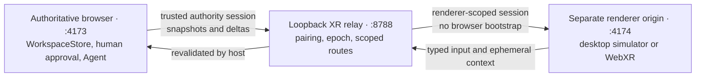
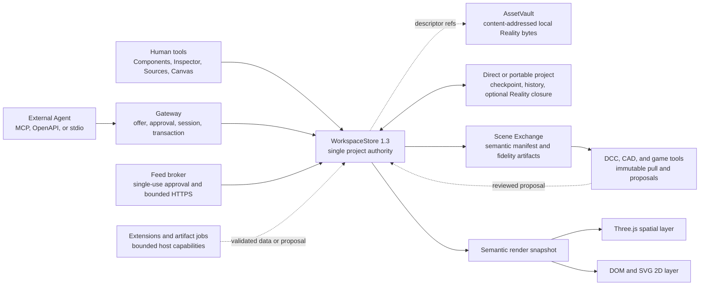

# SemaFrame

<p align="center">
  
</p>

<p align="center">
  <a href="https://github.com/riseagain1/semaframe/actions/workflows/ci.yml"></a>
  <a href="https://github.com/riseagain1/semaframe/releases/latest"></a>
  <a href="https://www.npmjs.com/package/semaframe"></a>
</p>

> **Build spaces agents can understand.**
>
> A browser-authoritative, agent-operated workspace where 2D interfaces, 3D space, live data, interaction, animation, collision, and bounded physics share one state model.

SemaFrame turns a browser canvas into a programmable visual workspace. A person or an approved external Agent can create spatial scenes, dashboards, controls, simulations, data panels, websites, charts, timers, checklists, and declarative custom components—then connect them through typed actions and events.

The central idea is simple: there is one authoritative `WorkspaceStore`. The UI, Agent API, data bindings, physics queries, project history, and hybrid renderer all operate on that same revisioned state. There is no hidden model-owned scene and no separate legacy Compose authority.

## See SemaFrame in action

These three silent-first English films show the product through ordinary-language outcomes. Click any poster to watch; sound is optional because the complete story is on screen.

<table>
  <tr>
    <td width="33%" valign="top">
      <a href="https://github.com/riseagain1/semaframe/releases/download/demo-gallery-v1/semaframe-realityops-v2-en.mp4"></a><br />
      <strong>Build a backup pump</strong><br />
      An Agent assembles editable parts, catches a blocked aisle, corrects the placement, wires data and controls, preserves history, and exports the model.<br /><br />
      <a href="https://github.com/riseagain1/semaframe/releases/download/demo-gallery-v1/semaframe-realityops-v2-en.mp4">▶ Watch film</a>
    </td>
    <td width="33%" valign="top">
      <a href="https://github.com/riseagain1/semaframe/releases/download/demo-gallery-v1/semaframe-living-room-public-demo-en.mp4"></a><br />
      <strong>Redesign a living room</strong><br />
      One request creates office and cinema spaces, rejects a sofa that blocks the doorway, routes one 2D control into the 3D room, and remains undoable.<br /><br />
      <a href="https://github.com/riseagain1/semaframe/releases/download/demo-gallery-v1/semaframe-living-room-public-demo-en.mp4">▶ Watch film</a>
    </td>
    <td width="33%" valign="top">
      <a href="https://github.com/riseagain1/semaframe/releases/download/demo-gallery-v1/semaframe-emergency-city-v4-en.mp4"></a><br />
      <strong>Open an emergency route</strong><br />
      AI reads dispatch data and scene semantics, rejects a collision, proposes safe endpoints, and one human-confirmed click commits 11 coordinated actions.<br /><br />
      <a href="https://github.com/riseagain1/semaframe/releases/download/demo-gallery-v1/semaframe-emergency-city-v4-en.mp4">▶ Watch film</a>
    </td>
  </tr>
</table>

The rooms, city, and feeds are deterministic synthetic evidence—not field scans, live infrastructure, or engineering certification. Video binaries live in the [Demo Gallery release](https://github.com/riseagain1/semaframe/releases/tag/demo-gallery-v1); Remotion source, captions, contracts, and captured evidence remain reviewable in [`video/`](./video/README.md). The [original 78-second launch tour](https://github.com/riseagain1/semaframe/releases/download/v0.2.0/semaframe-demo.mp4) remains available in the [v0.2.0 release](https://github.com/riseagain1/semaframe/releases/tag/v0.2.0).

## What's new in v0.4 RC

The current source candidate is `v0.4.0-rc.2`. It keeps the v0.3 modeling and Reality foundation, adds editable B-rep authoring and a production-oriented CAD handoff, and closes the next operational loops:

| Capability | What it adds |
| --- | --- |
| **Editable CAD parts** | Versioned SI parameters, bounded constraint sketches, ordered feature history, real OCCT B-rep evaluation, host-authored evidence, human Inspector editing, and atomic Agent authoring |
| **Verified CAD handoff** | A deterministic ZIP with a non-unioned AP242/XCAF assembly, names/colors/occurrences, OpenUSD scene layer, editable SemaFrame sidecar, limitations report, and geometric OCCT re-import proof |
| **Exact approved feed readback** | A revision-preserving `read_workspace_resource_snapshot` tool for canonical inline or HTTP-feed snapshots, gated by `workspace:read` plus non-default `effect:data_read` approval and bounded to exact non-secret results |
| **Independent 2D layout reasoning** | A derived 1440×900 Layout Graph, exact rotated-rectangle overlap checks, deterministic placement suggestions, legacy-safe repair, and auto-arrange—kept completely separate from physical 3D collision |
| **Routed spatial movement** | A typed `move_to` action for entities, exact primitives, CAD parts, and assemblies, with scale preservation, atomic event fan-out, endpoint collision and enforced-physics validation, and ordinary renderer transitions |
| **Registry-drift recovery** | Verified replay rebases registry-derived command and history digests when append-only built-in manifests advance, so valid project-schema 1.3 files reopen without weakening history validation |
| **Photo-set Reality reconstruction** | Human and approval-gated Agent flows for digest-bound photo upload, explicit local reconstruction, bounded progress/cancellation, browser-authoritative preflight, and content-addressed Reality registration |
| **Cross-platform XR renderer** | A separately paired WebXR client with revisioned Workspace replication, collision-safe teleport, renderer-neutral live panels, typed actions, Agent-guided setup, optional text-only-Agent Voice Relay, fresh authenticated spatial context, renderer-only build reveals, resumable Reality assets, reconnect, and a fail-closed Windows PCVR Ultra gate |
| **Portable projects** | A streamed `.semaframe-project` ZIP/ZIP64 bundle containing the replay-verified Workspace plus the complete content-addressed Reality byte closure required by current state, checkpoint, and retained undo/replay |
| **Scene Exchange and bridges** | A sanitized `.semaframe-exchange` with semantic manifest, fidelity report, OpenUSD, self-contained GLB, optional exact STEP, stable IDs, expiring pull sessions, and review-only downstream change proposals |
| **Extension and host services** | Versioned connector/importer/exporter/bridge contracts, digest/signature verification, Workspace-bound grants, an owned framed-stdio host, immutable connector registries, and bounded asynchronous artifact jobs |
| **Community ecosystem** | A signed static project/model template catalog with proposal-only installation plus explicitly opt-in, previewable anonymous performance diagnostics with no bundled vendor endpoint |

The `v0.4.0-rc.2` source surface is Workspace Protocol 1.3 with project schema 1.4, 25 Workspace MCP tools plus 10 ephemeral host-control tools, Agent Guide 3.2, MCP server 1.10.0, Agent Gateway OpenAPI 1.3.0, SemaFrame Layout Graph 1.0, and SemaFrame Spatial Graph 3.2. The latest stable release remains v0.3.0; this candidate uses the GitHub prerelease channel and npm `next`.

The v0.4 release candidate also hardens the product surface around those
contracts: explicit Agent states, direct Agent-first Workspace entry, a unified Checks center, Basic/Advanced
inspection, one atomic Sources Wizard, an outcome-aware Export Center, an XR
Setup Assistant, verified IndexedDB recovery, enforced CI coverage, and a
packaged `semaframe doctor/start/xr` CLI. [Read the v0.4.0-rc.2 notes](./docs/release-v0.4.0-rc.2.md).

The ecosystem contracts are documented separately in the [ecosystem layer guide](./docs/ecosystem/README.md). They preserve the same central invariant: neither an extension, template, artifact provider, nor downstream 3D application can bypass `WorkspaceStore`.

## What's new in v0.3

v0.3 moves SemaFrame beyond scene assembly into an Agent-native modeling and Reality workspace, while keeping the browser and one revisioned `WorkspaceStore` authoritative.

| New capability | What it adds |
| --- | --- |
| **Parametric modeling** | Exact SI primitives, editable multipart assemblies, collision-aware placement, numeric human controls, and immutable reusable model definitions with ordinary editable instances |
| **CAD and interchange** | Deterministic OpenUSD USDA, bounded Manifold STL/OBJ, and a real OpenCascade AP242 STEP subset running in lazy, cancellable Workers |
| **Gaussian Splat Reality Layer** | Human or approved-Agent import of PLY, SPZ v4, and SOG v2 captures with direct A/B surface-pick calibration, content-addressed browser storage, digest relinking, and editable semantic engineering proxies |
| **Agent-native spatial workflow** | SSG 3.1 spatial understanding, 18 approval-gated MCP tools, secure streaming asset ingress, collision and bounded-physics evidence, undo/redo, save/reopen, live data bindings, and typed 2D-to-3D actions |

Together, these capabilities support one inspectable workflow: import captured context, build exact semantic parts and proxies, check placement and feasibility, connect live controls, publish reusable models, preserve the result, and export standard formats—without taking editability away from the person using the workspace.

[Read the complete v0.3.0 release notes](./docs/release-v0.3.0.md).

## Contents

- [See SemaFrame in action](#see-semaframe-in-action)
- [What's new in v0.4 RC](#whats-new-in-v04-rc)
- [What's new in v0.3](#whats-new-in-v03)
- [Why SemaFrame](#why-semaframe)
- [A practical Jarvis-like workspace](#a-practical-jarvis-like-workspace)
- [What it can do](#what-it-can-do)
- [Quick start](#quick-start)
- [Hardware and runtime support](./docs/hardware-support.md)
- [XR and PCVR viewer](#xr-and-pcvr-viewer)
- [First Agent connection](#first-agent-connection)
- [Product tour](#product-tour)
- [Core model](#core-model)
- [Parametric modeling and interchange](#parametric-modeling-and-interchange)
- [Reality capture and Gaussian splats](#reality-capture-and-gaussian-splats)
- [Spatial understanding and physics](#spatial-understanding-and-physics)
- [Data feeds and websites](#data-feeds-and-websites)
- [Ecosystem and downstream tools](#ecosystem-and-downstream-tools)
- [Agent integration](#agent-integration)
- [Protocol and persistence](#protocol-and-persistence)
- [Security and trust model](#security-and-trust-model)
- [Current boundaries](#current-boundaries)
- [Architecture and code map](#architecture-and-code-map)
- [Development and verification](#development-and-verification)
- [Contributing and security](#contributing-and-security)
- [License](#license)

## Why SemaFrame

Most Agent interfaces expose documents, forms, or a chat transcript. SemaFrame instead exposes a persistent visual world with explicit geometry, data, behavior, history, and permissions.

It is designed around four principles:

1. **One shared authority.** Human edits and Agent transactions modify the same Workspace, so the rendered result, saved project, undo history, and Agent inspection cannot silently diverge.
2. **Semantic objects, not pixels.** Components retain typed props, durable state, placement, actions, events, bindings, collision, physics intent, provenance, and versioned manifests.
3. **Inspect before acting.** Agents receive revision-bound component, space, placement, and physics projections rather than guessing from a screenshot alone.
4. **Capability-based control.** Connections, approvals, sessions, scopes, transactions, feed fetches, and host signals are explicit and bounded.

SemaFrame is useful for Agent-driven dashboards, simulation controls, spatial planning, interactive explainers, mixed 2D/3D prototypes, operational views, and feasibility preflight. It is not a general web browser, an unrestricted code sandbox, or a full engineering solver.

## A practical Jarvis-like workspace

Imagine an assistant that does more than chat: it can inspect a shared 2D/3D workspace, understand where objects are, read approved live data, check collisions and physical support, and operate controls through explicit permissions.

For example, an Agent could inspect a workshop layout through the SemaFrame Spatial Graph, place a machine without intersecting existing equipment, attach a live telemetry panel, connect a 2D emergency-stop button to a 3D animation, run a bounded stability preflight, and leave every action visible in the same undoable project history.

SemaFrame provides this inspectable spatial substrate. It is not an autonomous operating system or a full engineering simulator: the browser remains authoritative, actions are scoped, and physical results are deliberately bounded.

## What it can do

| Area | Current capability |
| --- | --- |
| Universal canvas | Mix navigable Three.js content with DOM/SVG panels on one canvas |
| Component system | 20 versioned built-ins plus bounded Agent-defined declarative recipes |
| Parametric modeling | Exact SI primitives plus editable OCCT CAD parts with parameters, bounded constraint sketches, ordered features, assemblies, immutable reusable models, and numeric Inspector controls |
| Reality capture | Local photo-set reconstruction on supported Macs plus PLY, SPZ v4, and SOG v2 import, with direct two-point metric calibration, content-addressed storage, missing-byte relink, and editable semantic proxies |
| Solid export | OpenUSD USDA assemblies, bounded Manifold STL/OBJ solids, legacy fused STEP, and a verified non-unioned AP242/XCAF CAD handoff package |
| Spatial reasoning | Revision-bound SemaFrame Spatial Graph 3.2 with transforms, analytic and exact CAD evidence, visual-only Reality nodes, semantic proxies, bounds, colliders, support, and intersection relations |
| Collision | Asset bounds, explicit boxes, and compound oriented-box colliders with independent enable/trigger controls |
| Physics | Optional static/dynamic/kinematic intent, mass and material properties, constraints, stability reports, placement preflight, and deterministic settle previews |
| Data | Local JSON/CSV snapshots and approved public HTTPS JSON/CSV/RSS/Atom feeds |
| Projection | Schema-checked resource bindings into writable component props without mutating canonical props |
| Interaction | Typed actions and events routed atomically across 2D and 3D components |
| Animation | Discoverable spatial clips, durable playback state, bounded transitions, completion events, and reduced-motion support |
| Web and media | User-activated sandboxed website panels plus normalized YouTube, Vimeo, MP4, and WebM video |
| XR rendering | Separately paired desktop/WebXR client with revisioned projection, controller input, teleport, live 2D panels in 3D, typed actions, Agent-guided setup, optional text-only-Agent Voice Relay, live ephemeral spatial context, renderer-only build reveals, and fail-closed performance tiers |
| Agent control | Approval-gated Streamable HTTP MCP, OpenAPI 3.1, and a stdio bridge |
| Persistence | Direct metadata projects plus portable `.semaframe-project` bundles with deterministic replay, migration, undo/redo, validated provenance, and complete required Reality bytes |
| Extensibility | API `1.0` connector/importer/exporter/bridge contracts, digest-bound manifests and grants, framed native stdio hosting, immutable connector registries, and bounded artifact jobs |
| Downstream tools | Immutable `.semaframe-exchange` packages and review-only proposal bridges for Blender, FreeCAD, Unity, Unreal, or a custom client |
| Community layer | Signed static project/model template catalogs and off-by-default, exact-preview anonymous performance diagnostics |

The built-in component registry contains:

- spatial, modeling, and reality: `stage-3d`, `spatial-entity`, `spatial-primitive`, `cad-part`, `model-assembly`, `gaussian-splat`;
- layout: `group`, `panel`;
- content: `text`, `image`, `annotation`, `document`;
- media and web: `video-player`, `web-panel`;
- data: `data-panel`, `chart`, `table`;
- controls and utilities: `button`, `timer`, `checklist`.

## Quick start

### Requirements

- Node.js 22.12 or newer
- npm
- a modern browser with WebGL support
- an MCP-capable Agent client for external Agent control
- for local photo-set reconstruction only: a Mac where RealityKit reports `PhotogrammetrySession.isSupported`, plus Xcode command-line tools providing `xcrun swift`

If that optional Apple Object Capture requirement is unavailable, SemaFrame reports reconstruction as unavailable instead of faking a result. The rest of the Workspace—including prebuilt PLY, SPZ, and SOG Reality import—continues to work.

### Install and run

The release-candidate CLI can be tried in one line from npm. The exact version
keeps the install reproducible; `semaframe@next` follows the newest candidate.
It checks the Node version, required package files, and local ports before it
starts anything:

```bash
npm exec --yes --package=semaframe@0.4.0-rc.2 -- semaframe doctor
npm exec --yes --package=semaframe@0.4.0-rc.2 -- semaframe start
```

Use `semaframe xr` instead of `semaframe start` to include the separate XR
renderer. A remote headset still needs a trusted HTTPS URL reachable on the
LAN; the doctor reports this as an explicit warning rather than pretending a
physical headset was verified. Voice Relay is optional and off by default.

For development from the current source branch:

```bash
git clone https://github.com/riseagain1/semaframe.git
cd semaframe
npm ci
npm run dev
```

Open [http://127.0.0.1:4173](http://127.0.0.1:4173).

`npm run dev` starts both Vite and the loopback Agent Gateway. The main local endpoints are:

| Service | URL |
| --- | --- |
| Browser app | `http://127.0.0.1:4173` |
| Agent Gateway | `http://127.0.0.1:8788` |
| OpenAPI document | `http://127.0.0.1:8788/openapi.json` |

Useful alternatives:

```bash
npm run dev:vite          # browser UI only
npm run dev:xr            # browser host + gateway + separate XR renderer
npm run dev:xr:client     # separate XR renderer only
npm run agent:gateway     # one-shot gateway
npm run agent:mcp         # stdio MCP bridge
npm run build             # production build
npm run build:xr          # standalone XR production bundle in dist-xr/
npm run build:voice-relay # native macOS or Windows Voice Relay helper
npm run build:all         # typecheck and build both production origins
npm run preview           # preview the production bundle
npm run doctor            # non-mutating local host/port preflight
npm run test:cli:package  # pack, prod-only install, CLI and service-start smoke
```

The [hardware and runtime support matrix](./docs/hardware-support.md) states
which paths have automated, host-smoke, or physical-device evidence. SemaFrame
does not currently claim universal XR hardware certification.

### What appears on first launch

Before a connection completes, SemaFrame intentionally shows only the Agent connection interface—not an empty editable Workspace. The existing project remains preserved, but the canvas is unlocked only after an approved Agent completes the instruction handshake.

This makes ownership explicit: the browser is authoritative, while the external Agent receives scoped access to the open Workspace.

## XR and PCVR viewer

SemaFrame XR is a separate renderer for the same authoritative Workspace—not a second editor, a forked project, or an XR-only scene format. The host publishes revisioned semantic snapshots and deltas; the renderer draws them, presents bounded live panels, and returns typed selection, activation, panel-action, and authenticated ephemeral pose context for host-side validation. The relay supplies renderer provenance outside the client-controlled message payload, so the host can bind every action and pose to the exact paired renderer instead of trusting a claimed source.



### Local quick start

```bash
npm run dev:xr
```

This starts the authoritative app at [http://127.0.0.1:4173](http://127.0.0.1:4173), the loopback gateway at `http://127.0.0.1:8788`, and the standalone renderer at [http://127.0.0.1:4174/xr.html](http://127.0.0.1:4174/xr.html). Start a one-time XR pairing session in the host, then either enter its six-digit code in the renderer or open its secure link. Without an immersive runtime the same client remains available as an explicitly labeled non-immersive desktop simulator.

The Node 22 launcher and gateway load an optional repository-root `.env` before reading configuration. Existing shell variables always win, a missing file is ignored, and child-process control variables such as `NODE_OPTIONS`, `npm_execpath`, `PATH`, and `SystemRoot` are accepted only from the shell (including differently cased Windows variants). `.env.example` is the XR/local-launch quick-start template; `.env.agent.example` documents the optional gateway policy settings you can copy into `.env` and is not a second automatically loaded file.

The XR client intentionally lives on a different origin. Its Vite proxy exposes only `/api/xr`; it never receives the private browser-authority bootstrap header and cannot call `/api/agent`. Keep `VITE_XR_GATEWAY_ORIGIN` blank for this same-origin proxy arrangement. A direct gateway origin is an advanced deployment option and must be an exact credential-free HTTP(S) origin protected by the deployment boundary.

### Physical headset or PCVR setup

WebXR requires a secure context when the renderer is opened from another device. Configure an HTTPS URL reachable by the headset, use a certificate trusted by that device, and allow that exact renderer origin at the relay:

```bash
export VITE_XR_PUBLIC_URL=https://your-workstation.example:4174/xr.html
export SEMAFRAME_XR_ALLOWED_ORIGINS=https://your-workstation.example:4174
export SEMAFRAME_XR_HTTPS_CERT=/absolute/path/to/trusted-certificate.pem
export SEMAFRAME_XR_HTTPS_KEY=/absolute/path/to/private-key.pem
npm run dev:xr
```

Do not use a wildcard allowed origin and do not expose the loopback gateway's `/api/agent` routes. A production deployment should terminate trusted HTTPS in front of the XR origin and proxy only `/api/xr` back to the loopback service. The headset opens `VITE_XR_PUBLIC_URL`; `VITE_XR_GATEWAY_ORIGIN` normally remains blank. `dist-xr/` is static content and cannot carry HTTP response headers itself: its CDN or reverse proxy must reproduce `XR_STANDALONE_SECURITY_HEADERS` from `vite.xr.config.ts`, including CSP, Permissions-Policy, no-store, no-referrer, nosniff, and anti-framing headers. The HTML meta CSP is defense in depth, not a replacement for those headers.

Each pairing grant has two aliases for the same single-use capability: a human-enterable six-digit code and a high-entropy secure link. The code expires with the grant, is stored only as a process-keyed digest, and is protected by a five-attempt rolling one-minute limit; link redemption remains available during a code lockout. Consuming either alias invalidates both.

The secure link keeps its high-entropy secret in the URL fragment (`xr.html#pair=…`), so browsers do not send it in the initial HTTP request. The entrypoint removes the secret from address history before React or the network transport starts. After the renderer authenticates, the host removes the consumed code and link from its UI and retains only the non-secret pairing identity plus an opaque session credential in memory. Authority restart or revocation invalidates the renderer epoch and requires fresh pairing. Reconnect can replay only a current checkpoint or bounded revision deltas. Authenticated lifecycle presence is retained as a bounded transition sequence, so an Agent waiting on `ended` cannot miss it when `replica_ready` follows in the same poll.

### Capability and validation matrix

| Path | Current behavior | Validation boundary |
| --- | --- | --- |
| Desktop simulator on macOS, Windows, or Linux | Pairing, live revision replication, ordinary 3D navigation, HTML panel fallback, reconnect, and typed inputs | Automated contracts and browser-neutral renderer tests; it is deliberately marked non-immersive |
| Standalone headset WebXR | `immersive-vr`, local-floor reference space, controller rays, selection/activation, teleport, and balanced render budgets | Implemented against WebXR interfaces; physical Quest/controller comfort and runtime compatibility still require device testing |
| Windows PCVR | Uses the same standards-based Chromium/WebXR client with the active OpenXR runtime | Implemented path; Meta Horizon Link, SteamVR/browser combinations, cable/Air Link latency, and GPU stability still require representative Windows hardware |
| macOS | Full Workspace authority, relay, and desktop renderer are available; immersive mode appears only if the browser reports `immersive-vr` | There is no claim that macOS provides a supported PCVR runtime, and Windows Ultra is unavailable |
| World-space 2D panels | Text, number, chart, and button presentations mirror approved Workspace data; actions are revision-bound and reauthorized by the host | Confirmation-required actions receive a short-lived, one-use confirmation panel inside XR; stale, declined, replayed, wrong-renderer, or changed-revision proofs fail closed |
| Voice-capable Agent | GPT Live or another voice Agent listens through the computer microphone and uses the ordinary approved Workspace tools; SemaFrame adds no audio bridge | Microphone, realtime transport, model, and interruption behavior belong to the connecting Agent client |
| Optional Voice Relay | Controller squeeze, hand pinch, or the fallback button starts browser speech capture; one final transcript is staged in an explicitly selected text-only Agent composer and still requires confirm or cancel in XR | Off by default; browser speech support, OS Accessibility/UI Automation, a compatible desktop Agent window, diagnostics, and a per-session human arm are required |
| Windows PCVR Ultra | Higher splat/mesh budgets, 90 Hz target, full framebuffer scale, shadows, and expensive lighting | Locked by default. A label or configuration flag cannot unlock it |

Balanced XR accepts bounded SPZ v4, SOG v2, and Gaussian PLY—including the PLY produced by the bundled Apple photo-reconstruction path. The renderer rejects before download when an asset exceeds 96 MiB, an estimated 768 MiB of GPU data, 1.5 million splats, or spherical-harmonics degree 2; the scene keeps a deterministic placeholder instead. These are XR playback budgets, not changes to the Workspace's broader import limits.

Windows PCVR Ultra requires a current physical Windows x64 probe, hardware acceleration, an active Meta Horizon Link OpenXR runtime, immersive Chromium WebXR, and a sustained reference benchmark. Qualification is deliberately split across two explicit user actions: **Check Ultra** runs the native capability probe, then **Start Ultra benchmark** opens the measured immersive session. No native probe or headset session starts merely because the viewer was opened. The policy checks at least 60 seconds of 90 Hz evidence, p95 frame time, dropped frames, process/GPU memory headroom, native driver throttling telemetry, and runtime disconnects. Probe and benchmark evidence is re-evaluated immediately before entry and at least every 10 minutes; a fingerprinted receipt must still match both. Stale, changed, missing, or failed evidence degrades safely to Balanced XR while preserving the Workspace. The standalone entry does not synthesize evidence or offer a force switch.

The bundled Ultra evidence provider is intentionally narrow in v1: the gateway must run on Windows x64, Meta Horizon Link must be the active OpenXR runtime, and exactly one NVIDIA adapter must be observable through the Authenticode-valid NVIDIA-signed `System32\nvidia-smi.exe`. The provider never searches `PATH`; a missing, relocated, unsigned, non-NVIDIA-signed, or multi-GPU telemetry path fails closed to Balanced XR. Declare the physical transport before starting the combined gateway/viewer stack:

```powershell
$env:SEMAFRAME_XR_ULTRA_TRANSPORT = "link_cable" # or "air_link"
npm run dev:xr
```

That variable is an operator assertion describing the connection intended to be measured; v1 does not natively distinguish cable from Air Link or detect a mid-run link-mode change. It is not an eligibility override. Native probing is exposed only to an already-paired renderer. Adapter fingerprints use a process-private HMAC scoped to that authenticated renderer session, so the same GPU does not expose a stable cross-session identifier. Probe/sample subprocesses are globally single-flight, while each renderer and route has a bounded five-second cooldown with explicit HTTP 429 responses; the benchmark's normal samples are approximately six seconds apart. Thermal failure considers only NVIDIA's hardware/software thermal-slowdown reasons—idle and power-cap clock reasons are not treated as heat. Because the provider cannot reliably bind WebXR to one adapter on a multi-NVIDIA system, those systems remain Balanced XR. Ultra also remains unavailable when any probe, telemetry sample, or benchmark check cannot be established. AMD/Intel telemetry and non-Meta OpenXR runtimes remain Balanced XR in this first implementation. Passing the reference workload is a qualification heuristic for the bundled Ultra profile, not a promise that every multi-million-splat or high-triangle scene will sustain 90 Hz; scene-specific profiling and the physical hardware gate still apply.

The automated suite can validate protocol parsing, origin policy, one-time pairing, credential isolation, revision/epoch handling, reconnect, renderer state, panel DTOs/actions, speech state, locomotion math, asset budgets, and the Ultra decision policy. It cannot establish headset comfort, tracking quality, microphone behavior, real motion-to-photon latency, driver compatibility, or thermal stability on hardware that was not present during the run. SemaFrame XR has no hardware certification today; treat every Quest and Windows PCVR device/browser/runtime/GPU combination as a separate physical validation gate before calling it production-ready.

### Agent-guided XR and optional Voice Relay

A voice-capable Agent such as GPT Live uses the computer microphone directly and continues through the ordinary approved Workspace MCP tools. There is no headset-to-SemaFrame-to-Agent audio bridge in that path: microphone permission, streaming speech, interruption, and model replies remain the responsibility of the connecting voice client.

Voice Relay is a separate, optional fallback for a text-only Agent interface. It is off by default and follows an explicit sequence:

1. On the trusted desktop, prepare setup, grant any required operating-system Accessibility permission yourself, and choose one compatible Agent window from sanitized labels.
2. Run diagnostics. The optional no-send test inserts a random nonce only into an empty composer, reads it back exactly, and removes it without pressing Send.
3. Explicitly arm that confirmed target for the current local session. XR cannot select a desktop window or arm the Relay.
4. In immersive XR, hold push-to-talk and release to finish speech recognition. The bounded final transcript—not microphone audio—is staged into the exact empty Agent composer and displayed for review.
5. Choose **Confirm and send** or **Cancel** in XR. Confirm revalidates the target, unchanged draft digest, and exact Send control before one activation; cancel removes only the unchanged staged draft. A changed, missing, expired, or ambiguous target fails closed.
6. When the target exposes a bounded reply region, XR can show the reply as subtitles. In-headset text-to-speech is optional, can be switched off, and can be interrupted by the next push-to-talk turn. Short earcons can be muted independently; visual and controller-haptic state feedback remains available.

Only compatible, ordinary application windows are candidates. The native helpers reject SemaFrame itself, terminal and system/credential surfaces, and secure or password fields; they revalidate the process, window, composer, and Send control before sensitive operations. Target selection, the no-send draft test, and arming each consume a separate one-use proof created by a trusted desktop confirmation. If confirmation reaches the native boundary and the Send outcome becomes unknowable, SemaFrame does not retry. The Relay's transcript copy is bounded and volatile, leaves Relay memory after send/cancel/expiry, and never enters Workspace state, project files, undo history, or exports.

The Agent can help without acquiring those human capabilities. With the separately approved `host:voice_relay_setup` and `host:xr_prepare` scopes it can inspect readiness, prepare setup, request diagnostics or a Relay arm, prepare a same-device or remote-headset XR session, and request entry or exit. SemaFrame turns each sensitive request into a visible host action; only the person can choose the target, grant OS permission, arm desktop control, open a headset link, or provide the trusted browser gesture required by WebXR. Remote XR inspect, prepare, enter, exit, and wait results expose a sanitized `lifecycle_sequence`; pass it back as `after_sequence` to `wait_for_xr_session_state` to consume the next exact transition even when multiple phases arrive between Agent calls.

### Live XR spatial context

During an active immersive session, aim a controller ray at a real rendered surface and press **A/X** to place or replace one Spatial Pin; press **B/Y** to clear it. The voice-confirmation modal keeps priority over those buttons, and an empty ray is a visible miss rather than an invented coordinate. The paired renderer publishes Agent-readable user state at a bounded 250 ms cadence through its renderer-scoped credential, with an immediate update when the person places or clears the Pin and latest-only coalescing when transport is slower. The host returns only a fresh same-device or paired-headset sample and rejects stale, queued-too-long, future-dated, revision-mismatched, disconnected, or unauthenticated context.

One approved `get_live_xr_context` call returns the complete Agent-readable user snapshot through a dedicated MCP output schema. `data.context.headPose` is the current HMD/camera pose; `playerCapsule` is the room-scale body/clearance volume; and every `trackedInputs[]` entry has a stable `sourceId`, handedness, tracking state, target-ray mode and pose, optional grip pose, its own optional ray and real surface hit, plus observable select, squeeze, face-button, and thumbstick state. `primaryInputSourceId` identifies the source mirrored by the compatibility `primaryRay`/`rayHit`, while `activeInputSourceId` identifies the most recently active source; neither depends on array order. Selection and the latest Spatial Pin are included when present.

The result exposes its own freshness evidence instead of requiring the Agent to infer timing: `data.age_ms` is already the conservative end-to-end age—paired-headset transport/host receipt age plus renderer `sourceAgeMs`, or `sourceAgeMs` alone for same-device XR—so an Agent must not add `sourceAgeMs` again. `sampleSequence` orders snapshots, and `sourceTimestampBasis` states whether the source timestamp uses a performance time origin, Unix epoch, or an unknown legacy clock. Aggregate/head/input tracking and session-visibility states distinguish tracked evidence from limited, emulated, unavailable, lost, hidden, or unknown state. Agents should require an acceptable age, tracking quality, and matching Workspace revision before acting. When present, `data.context.spatialPin` contains the point at full numeric precision in metre-based `workspace-world-rub` coordinates, its surface normal and hit kind, source controller identity, placement revision, and optional target component.

The Spatial Pin is a latest-only deictic reference: placing another replaces it, and clearing it, leaving XR, changing revision, disconnecting the paired renderer, or replacing the project removes it. Its structured coordinate is exact within the current Workspace frame, while `authority: "render-interaction-estimate"` records that the hit came from rendered geometry or Reality LOD—not an analytic CAD face, survey measurement, or manufacturing tolerance. The rounded coordinate label visible in the headset is presentation only; Agents use the full-precision structured value.

This complete context is explicitly ephemeral and persistence-forbidden. It contains no audio or transcript and never mutates the Workspace, project file, undo history, or export. To keep a Pin deliberately, the person or an authorized Agent must perform a normal revisioned Workspace transaction: copy the current pinned `annotation` manifest from `begin_workspace_update`, create a `world3d` annotation whose placement position is the Pin's `workspacePositionM`, and submit that batch. The resulting annotation—not the live Pin—is ordinary editable, saveable Workspace state.

### Renderer-only materialization

When one live semantic commit adds visible 3D entities, the renderer can present them as a deterministic 2.0–3.9 second build reveal. Lightweight Reality, asset, parametric, collider, or fallback proxies establish location first; committed entities then appear in bounded hierarchy-aware order. Renderers support `full`, `subtle`, and `off` presentation modes.

Materialization is presentation only. It creates no Workspace operations or per-frame revisions and cannot change transforms, collision/physics truth, dirty state, history, saved projects, OpenUSD/CAD exports, or Agent inspection. Initial load, project open, reconnect, and context recovery project the current authority immediately; the same live batch is not replayed as a new build sequence.

### Voice Relay native helper

Voice Relay uses a small local helper: macOS Accessibility APIs on macOS and UI Automation on Windows. Build the helper for the current platform with:

```bash
npm run build:voice-relay
```

`npm run dev` builds the optional helper when needed unless `SEMAFRAME_VOICE_RELAY_SKIP_BUILD=1`; if it cannot be built, the rest of SemaFrame remains available and Voice Relay reports unavailable. The launcher hashes the exact locally built helper before starting the Gateway. A launcher that supplies another helper must pin it with `SEMAFRAME_VOICE_RELAY_HELPER_SHA256` (and may select an absolute `SEMAFRAME_VOICE_RELAY_HELPER_PATH`). The public npm tarball excludes prebuilt native binaries. `SEMAFRAME_VOICE_RELAY_ALLOW_UNSIGNED_HELPER=1` is a development/test-only escape hatch, not a production setting. Native Voice Relay is unavailable on Linux; XR and all non-Relay Workspace behavior remain cross-platform.

## First Agent connection

Codex and Claude Code can be connected once from the **Install once** section on
the Agent connection screen. The equivalent source-distributed CLI commands are:

```bash
semaframe agent install --client codex
semaframe agent install --client claude
semaframe agent status --client codex
semaframe agent update --client codex
semaframe agent remove --client codex
```

SemaFrame uses each client's official MCP CLI; it does not edit client config
files directly or run a browser-supplied command. The installed stdio launcher
stores only a fixed loopback Gateway origin—not an offer, approval token, or
bearer. Restart the Agent client once after an install, update, or removal.
After that, the same launcher process discovers fresh offers across Gateway
restarts, requires a new human approval for the new Gateway lifetime, and
refreshes added, changed, or removed MCP tools without a config rewrite or
launcher restart. It never automatically replays a failed tool call whose
mutation outcome may be ambiguous.

Any other Streamable HTTP MCP-capable client can still use manual pairing:

1. Start SemaFrame with `npm run dev`.
2. Enable Agent control and copy the short-lived connection URL.
3. Add that URL as an MCP server or connector in the external client.
4. The client reads `workspace://instructions/v1` and calls `get_workspace_instructions` first.
5. SemaFrame displays the client's name, fingerprint, requested scopes, and destructive capabilities.
6. Approve the request in the authoritative browser.
7. The Agent inspects and edits the same open project through revision-bound transactions.

The connection URL contains a random offer identifier, not authority. The first instruction request creates a separate approval claim. Approval, session, and transaction capabilities are never placed in the URL or project file. Stable local launchers discover only from the exact configured loopback origin; discovery cannot redirect a launcher to another local port or remote host.

Incomplete expired or failed offers can be replaced with **Create fresh URL**. **Revoke pairing** invalidates the current offer and live sessions. If the authoritative browser disappears, the engine becomes unavailable rather than creating a second hidden Workspace.

## Product tour

After the handshake, the Workspace exposes five primary surfaces:

- **Components** creates registered 2D and 3D components.
- **Inspector** edits the selected component, geometry, visual effects, collision, physics, actions, and data bindings.
- **Sources** previews, creates, refreshes, binds, rebinds, and removes data resources.
- **Canvas** provides direct selection, move, resize, frame, reset, zoom, and presentation controls.
- **Agent controls** show connection state, approval requests, active identity, recent history, and revocation actions.

Project controls provide **New**, **Open**, **Save**, **Undo**, and **Redo**.

A fresh project contains zero components. `canvas2d` and `viewport` content does not need a Stage. Create exactly one `stage-3d` before adding content in `world3d`, `surface`, or `billboard` space.

### Placement spaces

| Space | Meaning |
| --- | --- |
| `world3d` | Spatial content inside the Stage |
| `canvas2d` | Content on the zoomable 2D plane |
| `surface` | A 2D component attached to a named component surface |
| `billboard` | Screen-facing content anchored to a 3D target |
| `viewport` | Fixed HUD-style content in screen pixels |

Scroll or pinch over the background to zoom around the pointer. `viewport` components stay fixed. **Frame all** recovers both layers, while **Reset view** restores the canonical camera. Navigation and full-screen presentation are browser-local: they do not alter project revision, dirty state, saved files, history, or Agent authority.

## Core model

Every Workspace object is a versioned component with:

- a stable ID and pinned component type, version, and digest;
- typed props and durable state;
- placement and geometry;
- visual effects and visibility;
- locks and provenance;
- resource bindings;
- declared actions and events;
- optional collision and physics attributes for spatial entities, exact primitives, and CAD parts.

The engine validates operations against the pinned manifest. It does not silently clamp malformed commands or reinterpret stale component definitions.

### Geometry, effects, and animation

Each manifest declares supported placements and a resize policy. Geometry uses one of four closed models: `box2d`, `scale3d`, `stage_dimensions`, or `none`.

All components support renderer-neutral opacity, emissive color/intensity, glow, visibility actions, and bounded transitions. A transition has duration, optional delay, and a closed easing value. The semantic state commits once; DOM and Three.js interpolate the resulting revision without writing per-frame history and honor reduced-motion preferences.

Spatial components expose discoverable animation clips and durable `play_animation` and `stop_animation` actions. Playback starts only while both the entity and Stage are visible. Hiding or collapsing either one deterministically stops active playback. Renderer completion is a host-only signal and cannot be forged by an Agent or unattended event route.

### Cross-component actions

`connect_event` routes declared semantic actions in the same atomic Workspace commit as the source event. Routes are cycle-checked, bounded, deterministically ordered, and permission-checked again when they execute.

Examples include:

- a 2D button starting a supported 3D animation;
- a 2D control moving one or several 3D entities to validated endpoints;
- double-click or Enter/Space on a spatial object showing a 2D panel;
- a timer completion adding an item to a checklist;
- a selected chart point forwarding a schema-identical payload to another component.

Connections may use static validated input or forward the complete event payload when the event and action schemas are exactly identical. Arbitrary expressions and JavaScript are never evaluated. Privileged network, external-write, and extension effects cannot be wired for unattended execution.

The latest `spatial-entity`, `spatial-primitive`, `cad-part`, and `model-assembly` manifests expose a typed `move_to` action. It preserves scale and reuses ordinary Stage, placement-lock, endpoint-collision, and enforced-physics validation; one invalid target rejects the complete source action and its fan-out. Coordinates are world coordinates for a root component and parent-local coordinates for a child, matching ordinary `world3d` placement. A component may receive only one `move_to` target per revision; duplicate explicit or routed targets reject the whole commit. A transition animates the renderer from the previous revision to the committed endpoint—it is not route planning, swept-path collision detection, continuous physics, or a waypoint sequence.

### Agent-defined components

An approved Agent can define a bounded `recipe.*` component type, inspect its canonical digest, and create instances in a later transaction.

Recipes can declare schemas, defaults, writable props, actions, events, placements, resize policies, and a bounded node tree. The renderer accepts only a closed data vocabulary: stacks, grids, overlays, scrolling, text, shapes, images, icons, charts, tables, asset placeholders, buttons, sliders, toggles, inputs, and timers.

Recipes cannot execute HTML, JavaScript, JSX, iframe code, shaders, network requests, or arbitrary packages. Untrusted schemas reject regular expressions, references, unbounded combinators, and other synchronous validation-amplification paths.

## Parametric modeling and interchange

SemaFrame now has a closed modeling contract rather than inferring geometry from an asset label. A `spatial-primitive` stores one exact SI-metre descriptor:

- box dimensions;
- sphere radius;
- cylinder or cone radius, height, and axis;
- capsule radius, cylindrical height, and axis; or
- plane dimensions and normal axis.

The same canonical descriptor produces render geometry, local bounds, analytic collider evidence, volume, SSG output, physics evidence, persistence digest, and export geometry. Primitive scale remains identity so dimensions cannot silently disagree with a renderer transform.

A `cad-part` stores a versioned `CadPartDefinition` rather than a baked triangle mesh. Its SI parameter expressions drive bounded line/circle/arc constraint sketches and an ordered feature history. CAD V1 evaluates sketch profiles, extrude, revolve, boolean union/cut/intersection, through/blind holes, and explicit `all_edges` fillet/chamfer with OpenCascade. Shell, sweep, loft, and linear/circular pattern records are reserved in the schema but currently fail explicitly at evaluation; they never masquerade as completed geometry. Over-constrained sketches and invalid B-reps also fail closed, while under-constrained sketches remain valid with a recorded warning.

Successful evaluation records only compact, digest-matched evidence—body identity, exact B-rep status, bounds, volume, area, centre of mass, evaluator versions, and diagnostics—in the Workspace. Transferable render meshes stay outside persistence. The human Inspector provides a dimensioned plate/through-hole starter, feature history, measurements, manufacturing identity, and an advanced document editor. An Agent submits the same semantic document; the authoritative host evaluates it before commit, overwrites forged digest/evidence, and leaves revision, undo history, and the previous valid solid untouched if evaluation fails.

Serialized evidence is not trusted merely because its JSON fields and 32-bit definition digest are self-consistent. Before an external or recovery project containing CAD can replace the current Workspace, the browser rebuilds every unique CAD definition in a disposable Worker and compares the complete evidence record. Missing Worker isolation, a resource cap, a timeout, or any measurement mismatch rejects the open and leaves the current project unchanged.

A `model-assembly@2` is an editable transform root with `external_only`, `all`, or `none` collision policy, optional part/material identity, and validated fixed/revolute/slider/planar mate metadata. Mate endpoints must stay inside the assembly subtree; datum and topology roles are allowed only on CAD parts. These mates preserve intent for Agents and in the editable handoff sidecar; STEP occurrences do not contain downstream-native mate constraints, and SemaFrame does not yet have a kinematic assembly solver. Reparenting can preserve world or local transforms explicitly.

The **Models** panel publishes an assembly subtree as an immutable, digest-pinned model definition. V2 definitions preserve editable CAD documents, logical/part/material identity, and remapped assembly mate endpoints. An instance is materialized as an ordinary editable assembly, primitive, and CAD-part tree—not a hidden proxy. SemaFrame chooses a collision-safe starting location, reserves every ID atomically, and preserves the source definition when an instance is edited. Agents use the same `publish_model`, `inspect_workspace_model`, `instantiate_model`, and `delete_model_definition` contract with revision, scope, and ID-reservation checks.

### Export paths

| Format | Implementation | Intended use |
| --- | --- | --- |
| USDA | Deterministic OpenUSD layer, metres and Y-up, stable prim IDs, Xforms, analytic primitive geometry/materials, plus CAD hierarchy, transforms, and visibility | DCC, simulation, and spatial interchange; exact CAD geometry remains in STEP and the complete CAD recipe/material record in the SemaFrame sidecar |
| STL / OBJ | Bounded Manifold 3.5.1 WebAssembly union with watertight/manifold diagnostics and hard vertex/triangle/output caps; STL coordinates are conventional millimetres, OBJ coordinates remain metres | Mesh-solid handoff and 3D-print prototyping |
| STEP | Legacy real OpenCascade fused B-rep through Replicad, AP242 Part 21 in metres | One-solid handoff for the box/sphere/cylinder and uniform-transform subset |
| CAD package | Deterministic ZIP containing a non-unioned AP242/XCAF assembly, names/colors/product occurrences, USDA, full editable SemaFrame definition sidecar, machine-readable limitations report, hashes, and a geometric OCCT re-import proof | Continue detailed work in downstream CAD while retaining separate solids and the original Agent-editable recipe |

The production browser paths for CSG, CAD evaluation, and CAD handoff run in disposable, lazy-loaded Workers. Cancellation or a time limit terminates the Worker, which is the only reliable hard stop while synchronous WebAssembly geometry code is running. A headless Agent adapter without a disposable Worker fails CAD evaluation closed instead of falling back to in-process OCCT; controlled tests may inject a direct kernel explicitly. The OpenCascade runtime is served as one fingerprinted local WASM asset; it is not fetched from a CDN. The handoff Worker re-imports its own STEP and verifies solid count, aggregate world bounds, and volume before a package can be downloaded. Repeated exports of the same canonical definition with the pinned runtime are byte-identical.

This makes SemaFrame useful for accurate blockouts, rooms, furniture, fixtures, equipment envelopes, machined-part first passes, spatial assemblies, collision/stability preflight, and reducing the amount of manual rebuilding before downstream CAD refinement. Dimensions and evaluated solids are exact to the supplied constraints and OpenCascade model—not proof of manufacturing tolerance, survey accuracy, or fitness for purpose. It is deliberately described as **Agent-native spatial modeling with light parametric CAD**, not a replacement for a mature mechanical CAD/PLM stack. There is not yet robust persistent per-face naming, arbitrary edge selection, evaluated shell/sweep/loft/pattern features, GD&T/PMI, drawings, STEP import, vendor-native feature-tree generation, a kinematic mate solver, or FEA certification.

## Reality capture and Gaussian splats

The Reality Layer adds captured environments and objects without pretending that a probabilistic visual reconstruction is a CAD solid. A person can import a local PLY Gaussian splat, SPZ v4 file, or SOG v2 package from the **Reality** panel. An approved Agent with `asset:import` can import a file the user supplied to it through a one-time streaming upload grant. The gateway accepts neither an arbitrary local path nor a source URL, and raw bytes are never embedded in MCP JSON.

Every import is independently preflighted and SHA-256 hashed in the authoritative browser before it enters the local `AssetVault`. The vault uses origin-private file storage when available and otherwise stores a sanitized Blob in IndexedDB. Workspace state contains only a content-addressed `RealityAssetDescriptor`: format, byte and splat counts, safe coordinate/bounds metadata, digest, and `engineeringAuthority: "visual_only"`. Source file names, local paths, Blob URLs, upload bearers, and raw bytes are excluded from project JSON and Agent inspection.

A `gaussian-splat@1.0.0` component supplies editable placement, quality, visual effects, and one explicit calibration mode:

- `uncalibrated` preserves source units and does not claim metric bounds;
- `metadata-declared` records a declared unit and metres per source unit; or
- `reference-distance` records the measured source distance and real-world distance used to derive scale.

For reference-distance calibration, the Inspector can start a direct two-point pick on the visible Gaussian surface. The person chooses A and B with the pointer (or aims at viewport center and presses Enter), sees ephemeral markers and the measured source-space span, then enters the one known real distance and applies it. The pick is sampled from Spark's current Gaussian LOD, so it is deliberately labeled as a visual estimate—not survey or CAD measurement. Escape, selection changes, renderer replacement, or applying the calibration clears the ephemeral measurement session; it never becomes hidden authoritative geometry.

Source coordinates are mapped explicitly into SemaFrame's right/up/back (`RUB`) basis. Spark 2.1 renders the splat inside the existing Three.js scene so it participates in depth, selection bounds, visibility, glow, and context recovery. If local bytes are absent after opening a project on another browser, SemaFrame shows a deterministic placeholder. **Relink** accepts only a file with the descriptor's exact digest.

Reality data never owns collision, mass, support, constraints, CAD export, or structural feasibility. For an engineering-aware digital twin, link the splat to one or more editable `spatial-primitive`, `cad-part`, `spatial-entity`, or `model-assembly` components through `semanticProxyIds`. SSG 3.2 exposes the splat as a `reality` node plus `represented_by` / `proxy_for` relations; the proxies remain the sole engineering authority. A utility-pole capture, for example, can provide visual field context while an exact cylinder/CAD/assembly proxy drives clearance, collision, stability, and export.

Agent import is deliberately split into capabilities:

1. call `begin_workspace_asset_import` with the current Workspace ID, stable request ID, exact byte length, media type, and SHA-256;
2. stream the original bytes once to the returned exact `PUT` URL and bearer;
3. call `complete_workspace_asset_import` so the browser preflights, stores, and registers the candidate;
4. use `inspect_workspace_asset` for exact safe descriptor rediscovery; then
5. create a normal `gaussian-splat` component in a prepared Workspace batch: map returned `asset_ref.asset_id` to `props.assetRef.assetId`, copy the digest exactly, and provide explicit calibration.

### Reconstruct from photos

The **Reality** panel can take a local set of JPEG, PNG, WebP, HEIC, or HEIF images through the same bounded reconstruction protocol. For a person, the browser hashes the selected files, uploads them to the loopback worker, starts the job, shows its real phase and progress, and sends the finished candidate back through the existing browser-authoritative Reality preflight and vault. Source images are temporary job inputs: they are never embedded in MCP JSON, Workspace state, history, or a saved project.

An external Agent or MCP client can accept photo files supplied by its user, send only their exact manifests to SemaFrame, and `PUT` each raw image directly to the one-use per-photo grant returned for that manifest. SemaFrame never accepts arbitrary local filesystem paths, arbitrary source URLs, or base64-encoded photo bodies in MCP or REST JSON.

The bundled local backend requires a Mac where RealityKit reports `PhotogrammetrySession.isSupported` and where `xcrun swift` is available. Apple Object Capture first reconstructs a textured mesh; SemaFrame then samples that surface into a bounded Gaussian PLY for its Reality renderer. If the capability probe fails, reconstruction fails closed with an unavailable state. There is currently no bundled Windows, Linux, cloud, CUDA, or native neural-3DGS backend.

The browser-facing capability check is protected by a process-private bootstrap capability injected by the trusted local UI proxy, an exact allowed origin, and CSRF. The bootstrap value is not exposed to browser JavaScript. Gateway handler construction requires a valid 256-bit bootstrap capability and aborts before allocating route resources when it is omitted or malformed, so an accidental configuration omission cannot expose the config/CSRF surface. Successful and failed checks are briefly cached, and concurrent callers are coalesced onto one probe, so opening or re-rendering the Reality panel does not repeatedly launch Object Capture capability work.

An approved Agent must request the non-default `asset:reconstruct` scope and use the explicit five-tool flow:

1. call `begin_workspace_photo_reconstruction` with the current Workspace ID, a stable request ID, a quality profile, and 2–400 unique photo manifests containing exact media type, byte length, and SHA-256;
2. stream each original image once to its returned one-time `PUT` URL and bearer;
3. call `start_workspace_photo_reconstruction` only after every upload is byte-, signature-, length-, and digest-verified;
4. poll `inspect_workspace_photo_reconstruction`, or use `cancel_workspace_photo_reconstruction` with `confirm: true`; then
5. call `finalize_workspace_photo_reconstruction` with the ready output's exact SHA-256 and a display name. The authoritative browser independently preflights, hashes, stores, and registers the output before returning `asset_ref`.

The begin result's MCP `structuredContent` necessarily contains each short-lived upload URL and bearer once so the external client can perform the `PUT`. SemaFrame redacts those values from the human-readable tool text, project data, and Workspace history. An external MCP client or model provider can still log the structured result it receives, so its own retention and privacy policy remains part of the trust boundary.

The REST reconstruction routes are not a bearer-only shortcut. Every request must also prove an active, browser-approved claim whose approved scopes include `asset:reconstruct`. Unless a custom integration specifically needs REST, use the MCP five-tool flow above so approval, identity, and reconstruction lifecycle stay on the intended contract.

One reconstruction accepts 2–400 photos, at most 64 MiB and 100 megapixels per photo, at most 2 GiB of encoded inputs, and at most 1 billion decoded pixels across the set. The selected Apple profile adds a tighter aggregate decoded-pixel gate: 250 million for `preview`, 600 million for `balanced`, and 1 billion for `quality`. The finished candidate is capped at 256 MiB. The complete Apple working-output tree—Object Capture intermediates plus the generated PLY—is bounded by profile: 1 GiB for `preview`, 4 GiB for `balanced`, and 8 GiB for `quality`. A further 512 MiB free-space reserve is required and rechecked through conversion and private candidate staging.

Native memory is also fail-closed. Before launch, `preview`, `balanced`, and `quality` require respectively 3 GiB, 7 GiB, and 9 GiB of conservatively available system memory: a 2/6/8 GiB aggregate Object Capture process-tree RSS ceiling plus a 1 GiB system reserve. During reconstruction SemaFrame repeatedly rechecks both process-tree RSS and available memory; exceeding either bound, or losing either measurement, stops the dedicated process group and its last observed helpers with a retryable resource error. On macOS the available-memory estimate counts only `vm_stat` free, inactive, and speculative pages. Process RSS does not directly account for every GPU allocation, so the independent whole-system reserve is retained as an additional pressure guard rather than presented as an OS-level cgroup guarantee.

Graceful cancellation, grant revocation, and service shutdown attempt immediate temporary-file cleanup; a cleanup failure remains explicit and retryable instead of being reported as success. An abrupt tab close or network loss cannot guarantee that the browser's cancellation request arrives, so the service retains ownership, expires the job after its bounded two-hour lifetime, and sweeps its inputs. After a hard process exit, dead reconstruction roots are reclaimed on the next service startup once they pass a five-minute safety age.

Reconstruction quality still depends on coverage, overlap, focus, lighting, reflective/transparent surfaces, motion, and the Object Capture backend. Every generated asset starts as `visual_only` and `uncalibrated`, with source scale and coordinates explicitly unknown. It is visual reconstruction—not survey evidence, a collision mesh, a CAD solid, or a manufacturing-ready model. Add a known-distance calibration and editable semantic/CAD proxies before using the scene for metric, collision, physics, feasibility, or export decisions.

Automated repository verification uses valid synthetic image fixtures and a native backend capability probe. A manual macOS validation on August 25, 2026 also completed the browser-approved MCP workflow with all 51 photos from the public [ink-splashed skull photogrammetry test set](https://gitlab.com/photogrammetry-test-sets/skull-turntable-strong-lights-white-background-ink-splashed-textureless-areas): `preview` produced 250,000 splats and `balanced` produced 1,000,000 splats. This is end-to-end workflow evidence, not measured field accuracy or a permanent CI fixture; the source photos and generated artifacts are intentionally not committed.

Current import limits are 256 MiB, 4 million splats, and 128 registered descriptors per Workspace. A direct `.semaframe.json` project remains a metadata/reference artifact and may require same-digest relinking on another browser. Use `.semaframe-project` when the destination needs the complete verified Reality byte closure in the same artifact.

## Spatial understanding and physics

### Universal Space Data: two independent occupancy domains

`inspect_workspace_space` returns two parallel, revision-bound JSON projections of the same authoritative Workspace:

- `data.layout_graph` is **SemaFrame Layout Graph 1.0** with `dimension_domain: "ui2d"`. It resolves `canvas2d` and `viewport` components onto one logical 1440×900 authoring plane, including authored size, rotation, polygon bounds, overlap relations, and deterministic placement preflight through `query_layout_placement`.
- `data.spatial_graph` is **SemaFrame Spatial Graph 3.2** with `dimension_domain: "world3d"`. It contains metre-based world transforms, geometry, colliders, physical relations, and Reality/proxy semantics.

These domains are intentionally disjoint: 2D rectangles are checked only against other 2D rectangles, and physical 3D colliders only against other physical 3D colliders. A 2D panel may appear over a 3D object without creating a collision. New 2D overlaps reject the complete atomic update; old projects with pre-existing overlaps still open, expose blocking Checks, permit non-layout edits and overlap reduction, and can repair movable panels with **Auto-arrange 2D**.

`surface`, `billboard`, and non-spatial `world3d` cards remain in the 2D graph but are marked `projection_dependent`: their apparent screen overlap varies with camera, target surface, and viewport, so a persisted camera-independent Store cannot honestly claim a permanent hard result for them. The canonical layout and spatial graphs together are SemaFrame's **Universal Space Data** for Agent reasoning; neither is Pixar OpenUSD.

### SemaFrame Spatial Graph

`inspect_workspace_space` returns **SemaFrame Spatial Graph 3.2 (SSG)** in `data.spatial_graph`: a revision-bound, model-readable projection of the open Workspace. It includes:

- stable prim paths and component identity;
- parent-aware world transforms;
- explicit asset, primitive, CAD, assembly, and visual-only Reality node kinds;
- exact primitive parameters, digest, dimensions, local bounds, volume, analytic collider, and material summary;
- exact CAD definition/evaluator identity, body count, local bounds, B-rep volume/area, and feature diagnostics;
- assembly collision policy, model reference, ancestry, and aggregate descendant bounds;
- Reality Asset identity, calibration, metric-bounds status, and semantic-proxy relations without local byte disclosure;
- asset-derived and component-derived world bounds;
- exact collider parts;
- rigid-body intent;
- containment, intersection, contact, and support relations;
- optional deltas through `since_revision` when the change is unambiguous.

SSG is derived JSON, not a second scene database and not a Pixar OpenUSD file. The authoritative data remains the Workspace.

### Collision

Current spatial entities, parametric primitives, and evaluated CAD parts support:

- asset-derived bounds;
- one explicit box collider; or
- up to 16 compound oriented-box parts.

Parametric `asset_bounds` comes from the exact geometry descriptor, and CAD `asset_bounds` comes from verified OCCT B-rep bounds—not an asset approximation. SSG preserves analytic primitive evidence and exact CAD measurements, while the current feasibility narrow phase conservatively tests their oriented bounding volumes. Assembly policy can ignore internal part/part contacts while retaining external collisions, include all contacts, or exclude the assembly subtree from collision feasibility.

Collision can be enabled or disabled independently of physics. A collider may also be a trigger. Solid overlaps reject the entire atomic update; touching faces and trigger volumes are represented explicitly. Parent/child attachment can use a safety margin, but true solid penetration remains invalid.

### Physics attributes

Physics is optional per component. Turning the physics master switch off preserves configured values while excluding the body from support, constraint, and settle participation.

Supported attributes include:

- static, dynamic, and kinematic body type;
- mass and center-of-mass offset (applied from the evaluated geometric centre of mass for CAD parts, otherwise from resolved bounds);
- friction, restitution, and gravity scale;
- report or enforce stability mode;
- up to 16 fixed, hinge, slider, or ball constraints.

`inspect_workspace_physics` reports contact geometry, grounded load paths, world center of mass, stability margin, collisions, and conservative joint equilibrium. `query_stable_placement` preflights a candidate placement. `simulate_workspace_physics` runs a bounded deterministic fixed-step vertical-drop preview and returns absolute placement proposals plus explicit modeled and ignored properties.

This can test layout feasibility, collision-free assembly, quasi-static support, center-of-mass stability, simple constraints, and conservative settling. It does **not** prove material strength, stress, fracture, fatigue, frictional sliding, bounce, angular dynamics, soft bodies, fluids, manufacturing tolerances, or general engineering feasibility.

## Data feeds and websites

### Data resources and bindings

Resources hold a connector type/version, safe public configuration, last-good immutable snapshot, content hash, retrieval time, refresh policy, and bounded provenance. Credentials are never persisted.

Two data paths are available:

- `inline.snapshot@1.0.0` accepts bounded local or Agent-submitted JSON/CSV-like data without network execution.
- `http.feed@1.0.0` lets a person preview a public HTTPS JSON, CSV, RSS, or Atom endpoint through the trusted loopback broker.

`bind_resource` projects a snapshot value into a writable component prop through closed transforms. Binding `$.labels` and `$.series` produces a chart; binding `$` to `data-panel.data` renders a general feed as a bounded table, card list, or inert JSON view. Projection does not mutate canonical component props or create a Workspace revision.

The broker sends no cookies, credentials, custom headers, request body, or ambient browser authority. It validates DNS and every redirect, blocks private/link-local/special-use targets, pins TLS to the validated address, and bounds total time, redirects, concurrency, compressed and decoded size, XML structure, output schema, and credential-like content.

Interval and on-open automation is authorized only by in-memory consent after a successful preview and matching save. Opening or restoring an untrusted project cannot silently start network reads. Changing the URL, format, policy, project, or resource revokes that consent.

Agents can inspect and bind an existing host feed, but cannot mint feed approval, initiate network reads, forge host provenance, or create `http.feed` resources. Exact current values are available through `read_workspace_resource_snapshot` only when the approved session explicitly requests both `workspace:read` and the non-default `effect:data_read` scope. The read is limited to canonical host-normalized `inline.snapshot@1.0.0` and `http.feed@1.0.0` snapshots, never returns connector configuration or secret references, never refreshes or contacts the source, and never changes the Workspace revision. Results are exact up to 1 MiB; larger snapshots fail explicitly instead of being truncated. Resource metadata, output schema, snapshot data, and provenance remain untrusted external data.

### Website panels

`web-panel` embeds an approved public HTTPS page in a resizable 2D panel. It starts as a no-network facade. A person must choose **Load website** for that exact component instance; URL changes, project replacement, component recreation, or unload require another gesture.

The Store rejects HTTP, local/private/special-use targets, custom ports, embedded credentials, and recognized signed, session, login, reset, invitation, or authorization capabilities. The frame uses an opaque-origin `allow-scripts` sandbox with no forms, same-origin authority, popup, top navigation, referrer, or ambient browser permissions.

Not every site allows embedding. CSP or `X-Frame-Options` may refuse the frame, and the browser does not provide a reliable cross-origin success signal. **Open in browser** is the explicit fallback. Truly arbitrary browsing requires a separate trusted browser or native webview surface.

### Video panels

`video-player` accepts normalized YouTube, Vimeo, and public HTTPS MP4/WebM sources. It also begins as a facade and creates no iframe or media element until a person chooses **Load video**. Private, DRM-protected, owner-disabled, expired, or unsupported media can remain unavailable. Pasted iframe HTML and credential-bearing URLs are rejected.

## Ecosystem and downstream tools

SemaFrame's ecosystem layer expands file portability, data/provider integration, and downstream 3D workflows without creating another scene authority.

### Portable Workspace artifacts

`.semaframe-project` version `1.0` is a deterministic stored ZIP/ZIP64 archive. It contains the normal replay-verified Workspace JSON plus every content-addressed Reality object required by current state, checkpoint, and retained undo/replay history. Export verifies each source object before streaming. Import verifies exact paths, entry order, CRC, SHA-256, Reality format, project replay, and closure before staging any bytes; a failed atomic project replacement rolls back newly inserted objects.

The direct `.semaframe.json` format remains useful when small metadata-only files and digest relinking are preferred. See [Portable projects](./docs/ecosystem/portable-projects.md) for the format and trust boundary.

### Extension SDK and host services

Extension API `1.0` defines connector, importer, exporter, and bridge providers. Strict manifests pin package size and SHA-256, declare exact providers and permissions, and optionally carry an Ed25519 signature. A host can require signatures and supplies its own pinned-key verifier; the SDK does not decide publisher trust.

This is currently a source/embedding contract, not a compiled public SDK or an installed extension runtime. The public npm package is a CLI/source distribution with no library exports, and the app/gateway does not automatically instantiate the native host, extension grants, connector registry, artifact scheduler/HTTP handler, catalog planner, or diagnostics collector. An embedding host must wire and authorize the services it elects to expose; there is no built-in extension installer UI.

Grants bind the exact extension/version/manifest digest to one Workspace, provider set, permission set, expiry, and optional network or secret scopes. The native host owns one length-framed stdio subprocess, checks its package-root entrypoint, minimizes the environment, reauthorizes every call, and kills the process after abort, timeout, or protocol failure. This is not an OS sandbox, so native code still requires a trusted publisher.

`ConnectorRegistryV1` captures an immutable, digest-bound provider set for one open Workspace. Missing providers leave existing snapshots readable but cannot execute. `ArtifactJobService` adds owner/Workspace-scoped, idempotent, cancellable exporter/bridge jobs with bounded concurrency, runtime, JSON input, output count/bytes, content-addressed results, and expiry. See the [Extension SDK](./docs/ecosystem/extensions.md) and [host services](./docs/ecosystem/host-services.md).

### Scene Exchange and bridge proposals

One `.semaframe-exchange` represents one immutable Workspace revision. It contains safe semantic nodes and connections, a per-component fidelity report, deterministic OpenUSD, self-contained GLB, and optional exact STEP. Connector configuration, secret references, feed values, host-owned local-path references, and Reality Asset bytes do not cross this boundary. The Project Bar export and live Bridge currently emit OpenUSD/GLB plus semantics; exact STEP is included only when an embedding host supplies verified STEP bytes and mapped 3D component IDs. For the app's existing exact CAD path, use the Export Center's verified CAD handoff.

Blender, FreeCAD, Unity, Unreal, or a custom client can pull a session-scoped publication and return bounded transform, property, presentation, or hierarchy edits. Those edits are proposals, not mutations. SemaFrame rejects stale sources, locks, invalid props, cross-domain 2D/3D moves, missing parents, and hierarchy cycles; only explicitly selected eligible changes become normal Workspace operations and still pass the ordinary atomic transaction checks. The included adapters are narrow reference implementations, and repository verification is not physical certification of every host/OS combination. See [Scene Exchange and bridges](./docs/ecosystem/scene-exchange.md) and the [adapter compatibility matrix](./docs/bridges/compatibility.md).

### Signed templates and diagnostics

The static template catalog verifies an operator-pinned Ed25519 signature, monotonic sequence, signed expiry, safe relative paths, and every artifact digest before parsing. Project and model templates remain ordinary bounded Workspace operation proposals with `authorization.status = "not_granted"`; installation requires an explicit host review and normal transaction authorization.

Anonymous performance diagnostics are off by default. Enabling them only permits construction and exact preview of an allowlisted payload; transmission remains a separate explicit host action. The included collector has no vendor destination and stores no project identifiers, URLs, digests, paths, tokens, stable IDs, IP addresses, or User-Agent values.

## Agent integration

SemaFrame exposes 25 authoritative Workspace MCP tools. When the browser-backed
host-control surface is available, the same approved connection also exposes 10
ephemeral Voice Relay and XR preparation tools. Host-control calls prepare or
inspect a user-visible local action; they are not a second mutation path, and
the Agent still changes the scene only through Workspace transaction tools.

| Phase | Tool |
| --- | --- |
| Handshake | `get_workspace_instructions` |
| Inspect | `inspect_workspace` |
| Inspect | `inspect_workspace_component` |
| Data read | `read_workspace_resource_snapshot` |
| Inspect | `inspect_workspace_asset` |
| Inspect | `inspect_workspace_model` |
| Inspect | `inspect_workspace_space` |
| Inspect | `query_layout_placement` |
| Inspect | `query_spatial_placement` |
| Inspect | `inspect_workspace_physics` |
| Inspect | `query_stable_placement` |
| Inspect | `simulate_workspace_physics` |
| Asset import | `begin_workspace_asset_import` |
| Asset import | `cancel_workspace_asset_import` |
| Asset import | `complete_workspace_asset_import` |
| Photo reconstruction | `begin_workspace_photo_reconstruction` |
| Photo reconstruction | `start_workspace_photo_reconstruction` |
| Photo reconstruction | `inspect_workspace_photo_reconstruction` |
| Photo reconstruction | `cancel_workspace_photo_reconstruction` |
| Photo reconstruction | `finalize_workspace_photo_reconstruction` |
| Mutate | `begin_workspace_update` |
| Mutate | `submit_workspace_batch` |
| History | `undo_workspace_batch` |
| History | `redo_workspace_batch` |
| Events | `read_workspace_events` |
| Host voice | `inspect_voice_relay` |
| Host voice | `prepare_voice_relay_setup` |
| Host voice | `run_voice_relay_diagnostics` |
| Host voice | `request_voice_relay_arm` |
| Host XR | `inspect_xr_readiness` |
| Host XR | `prepare_xr_session` |
| Host XR | `request_enter_xr` |
| Host XR | `wait_for_xr_session_state` |
| Host XR | `request_exit_xr` |
| Host XR | `get_live_xr_context` |

The normal Agent flow is:

1. obtain approval through `get_workspace_instructions`;
2. retain the returned `session_token` and map `guide_digest` to the `instruction_digest` input used by subsequent tools;
3. inspect the Workspace, exact components/assets/models, spatial projection, or physics report;
4. begin an update against an exact revision and registry digest;
5. submit one bounded atomic operation batch;
6. retry safely with the same request ID, or inspect the new revision before continuing.

Host preparation stays outside Workspace persistence. Read-only readiness and fresh-context calls require `workspace:read`; setup or entry requests additionally require the separately approved `host:voice_relay_setup` or `host:xr_prepare` scope. A successful request can return a required user action, but it cannot grant OS permission, choose or arm a desktop target, or synthesize a WebXR gesture.

For a remote headset, retain the returned `lifecycle_sequence` and supply it as `after_sequence` to `wait_for_xr_session_state`. The host reads a bounded authenticated transition log rather than sampling only the latest label, so short states such as `ended` remain observable even if `replica_ready` is already current. Same-device XR keeps the simpler local state wait.

Voice, realtime, and multimodal clients use this same contract. Partial model output stays in client-side preview state; only final intent becomes a Workspace transaction. SemaFrame owns validation, rendering, history, permissions, and persistence. It does not bundle an AI model or cloud speech provider; voice-capable Agents use their own computer-microphone path, while optional Voice Relay uses browser speech support and the local helper described above.

For non-MCP clients, OpenAPI 3.1 is published at `http://127.0.0.1:8788/openapi.json` with bearer-authenticated `/v1/workspace/*` routes. Photo-reconstruction REST calls additionally require the private proof for an active browser-approved `asset:reconstruct` claim; a pairing bearer by itself is insufficient. The generated stdio setup loads the TypeScript bridge in the configured Node process—without an npm or `tsx` CLI wrapper that could orphan the bridge when an MCP host terminates it—and forwards every call through the browser-approved Streamable HTTP MCP authority. Signal shutdown and stdin EOF both abort an in-flight upstream request. Stable installations contain only `SEMAFRAME_AGENT_GATEWAY_URL` plus a display name and discover a fresh non-authorizing offer at runtime; `SEMAFRAME_AGENT_MCP_URL` remains a legacy one-off compatibility input. The stdio bridge is not a second REST authority path, so reconstruction tools use the same approved claim and non-default scope as a direct HTTP client. The local setup UI keeps this separate from the explicit credentialed REST-config copy action.

## Protocol and persistence

### Workspace Protocol 1.3

The closed protocol supports 24 operations:

- lifecycle: `define_component_recipe`, `create_component`, `update_component`, `upgrade_component_manifest`, `delete_component`;
- layout: `place_component`, `resize_component`, `attach_component`, `detach_component`;
- behavior: `set_component_visual_effects`, `invoke_component_action`;
- data: `upsert_resource`, `delete_resource`, `bind_resource`, `unbind_resource`;
- Reality Asset metadata: host-only `register_reality_asset`, `delete_reality_asset`;
- wiring: `connect_event`, `disconnect_event`;
- reusable modeling: `publish_model`, `instantiate_model`, `delete_model_definition`;
- metadata and reset: `present_view`, `clear_workspace`.

Every batch carries exact Workspace identity, base revision, registry digest, request ID, and a bounded operation list. Validation and reduction occur on a draft. Any failure leaves authoritative state unchanged. Identical retries are idempotent; changed retries, stale revisions, unknown fields, unpinned digests, invalid geometry, collisions, and missing permissions fail closed.

Saved components remain pinned to their manifest version. `upgrade_component_manifest` explicitly moves a compatible older built-in to the latest exact reference as one atomic, undoable, replayable operation. Workspace project-schema 1.0 through 1.3 migrations remain supported.

Protocol source of truth:

- [`src/workspace/protocol/workspaceProtocol.schema.json`](src/workspace/protocol/workspaceProtocol.schema.json)
- [`src/workspace/protocol/workspaceTypes.ts`](src/workspace/protocol/workspaceTypes.ts)
- [`src/workspace/agents/contracts.ts`](src/workspace/agents/contracts.ts)

### Direct and portable project files

**Save** exports one direct `WorkspaceProjectFile` with `formatVersion: "1.0"`. It contains:

- the checkpoint and current Workspace state;
- recipes, pins, geometry, state, locks, aliases, and provenance;
- resources, bindings, event connections, and shared views;
- safe Reality Asset descriptors and digest-pinned component references, but never their binary payloads;
- monotonic component and event counters;
- resolved command and event history for deterministic replay.

Open validates the closed schema, registry digests, counters, command continuity, resource invariants, and replay before replacing the current project. It never reruns actions, models, Reality Asset imports, or connector reads.

Projects from the removed pre-Workspace runtime and its dual-envelope format are intentionally unsupported. Local recovery uses the same Workspace-only representation. Provider credentials, feed approvals, MCP approvals, session tokens, and transaction tokens are never saved.

Project schema: [`src/workspace/persistence/workspaceProject.schema.json`](src/workspace/persistence/workspaceProject.schema.json).

**Save portable project** wraps that same validated direct project in `.semaframe-project` version `1.0` and adds the complete content-addressed Reality byte closure required by current state, checkpoint, and retained undo/replay. The deterministic stored ZIP/ZIP64 format supports streaming, so a large valid bundle does not need to be assembled in memory. Its manifest and object paths are canonical and digest-pinned.

Portable open validates exact archive structure, CRC, SHA-256, Reality preflight, project replay, and closure before replacing the current project. Missing objects are staged into the destination vault only after complete validation; if project replacement rejects, newly inserted objects are rolled back. Existing direct JSON projects remain supported through magic-based format detection.

Portable format details and schemas: [`src/workspace/persistence/portable/`](src/workspace/persistence/portable/) and [Portable projects](./docs/ecosystem/portable-projects.md).

### Application limits

Hard limits bound main-thread work, memory use, persistence, and replay:

| Resource | Limit |
| --- | ---: |
| Components | 2,000 |
| Data resources | 1,000 |
| Event/data connections | 5,000 |
| Aliases | 4,000 |
| Shared views | 500 |
| Agent-defined recipes | 200 |
| Registered Reality Assets | 128 |
| One Reality Asset binary | 256 MiB / 4 million splats |
| Photo reconstruction set | 2–400 photos / 2 GiB encoded / 1 billion decoded pixels |
| One reconstruction photo | 64 MiB / 100 megapixels |
| Reconstruction output candidate | 256 MiB |
| Apple working-output tree | `preview` 1 GiB / `balanced` 4 GiB / `quality` 8 GiB, plus a 512 MiB free reserve through conversion and candidate staging |
| Apple decoded pixels | `preview` 250M / `balanced` 600M / `quality` 1B |
| Apple process-tree RSS | `preview` 2 GiB / `balanced` 6 GiB / `quality` 8 GiB, plus 1 GiB available-memory reserve |
| Public history summaries | 512 |
| Recent undoable commands | 64 |
| Idempotency ledger entries | 4,096 |
| Project file size | 25 MiB |
| Portable manifest | 1 MiB |
| Portable Reality closure | 128 objects / 256 MiB each; streamed ZIP64 supported |
| Scene Exchange change proposal | 100 changes / 1 MiB |
| One live Bridge archive | 64 MiB through the local browser owner surface; 512 MiB service ceiling for an embedding host |
| Artifact jobs (defaults) | 32 queued / 2 concurrent / 30 s / 16 outputs / 32 MiB total output |

Older commands are compacted into a checkpoint rather than allowing undo memory to grow without bound.

## Security and trust model

SemaFrame treats the browser as the authoritative host and external clients as scoped callers.

Important boundaries include:

- the gateway binds to loopback and starts disabled;
- every `/api/agent/*` browser-authority route additionally requires a random process-private bootstrap header injected by the local UI proxy; both fetch and Node handler construction fail closed if that capability is absent or malformed, spoofing `Origin` is insufficient, and a public reverse proxy should never expose those browser routes;
- connection URLs identify offers but do not carry session authority;
- approvals are bound to the instruction surface, client identity, requested scopes, and browser lease;
- mutation requires a scoped session plus a short-lived revision-bound transaction;
- capability values are redacted from diagnostics and excluded from projects and recovery;
- portable project import requires canonical archive structure, an exact manifest closure, CRC/SHA-256 and Reality-format verification, validated replay, and staged rollback before it can replace the current project;
- Scene Exchange removes connector configuration, secret references, feed snapshot values, local paths, and Reality bytes; session bearers authorize immutable pulls and proposal submission only, never direct Workspace mutation;
- bridge proposals are source-digest/revision bound, review locks and hierarchy/domain validity, and produce no Workspace operations until the person explicitly selects eligible changes;
- extension packages are length/digest checked, can be required to carry a host-verified Ed25519 signature, and receive time-bounded grants tied to exact package, Workspace, provider, permission, network-origin, and secret-ID scopes;
- the native extension host owns one package-root stdio child with bounded framed messages and fail-closed termination, but is explicitly not an OS sandbox for untrusted executable code;
- connector registries are immutable per Workspace session; extension connector/artifact execution requires a host grant, connector configuration/results reject embedded credential-like material, and artifact requests/results also reject raw local paths;
- signed template catalogs pin operator key, sequence, expiry, safe artifact path, and descriptor digest, while every installation remains an unauthorized Workspace transaction proposal until the host confirms it;
- anonymous performance diagnostics are off by default, expose their exact allowlisted payload before any send, and have no bundled vendor destination;
- Agent Reality imports require `asset:import`, an exact user-provided file digest, a one-time upload grant, browser-side preflight, and a browser-owned content-addressed vault;
- Agent photo reconstruction requires the separate non-default `asset:reconstruct` scope, an exact per-photo manifest, one-time byte-verified uploads, an explicit start, digest-pinned finalization, and browser-owned final preflight; temporary source photos never enter Workspace state or project files;
- photo upload grants appear once in MCP `structuredContent` because the client needs them for its exact `PUT`, while human-readable tool text, projects, and Workspace history stay redacted; the external client's own structured-result logging remains outside SemaFrame's control;
- SemaFrame accepts photo bytes only through those one-use grants—not through a local path, source URL, or base64 field—and the reconstruction REST bridge also requires proof of an active approved `asset:reconstruct` claim;
- browser reconstruction capability probes require the local proxy bootstrap, exact allowed origin, and CSRF, then briefly cache and coalesce duplicate checks;
- graceful cancellation, revocation, and shutdown clean temporary reconstruction data immediately when possible; abrupt browser loss falls back to the bounded two-hour server job expiry, failed cleanup remains retryable, and startup reclaims dead roots after a five-minute safety age;
- connector network reads require a person-mediated single-use approval;
- resource schemas, payloads, paths, transforms, and provenance are bounded and validated;
- feeds reject private networks, credential-like URLs/content, unsafe redirects, excessive bodies, and long-lived sockets;
- web and video content begins behind an explicit user-activation facade;
- event routes reauthorize their target actions and cannot call non-routable host signals;
- declarative recipes have no arbitrary code or network execution;
- project replacement invalidates ephemeral web activation, feed automation consent, and in-flight refresh work;
- the standalone XR origin receives no browser-authority bootstrap capability, pairs through a single-use fragment secret, and uses only session-scoped relay routes;
- renderer inputs never mutate the Workspace directly: the authoritative browser checks session epoch, revision, input schema, target/action availability, and required human confirmation again;
- live XR pose context is accepted only from the exact paired renderer session and exact allowed origin, remains revision- and freshness-bound, contains no audio or transcript, and is never persisted;
- Voice Relay setup, target selection, diagnostics, and arming are desktop-only; target configuration, the no-send composer test, and arm each require an action-bound, one-use proof minted only after a trusted local confirmation;
- the paired XR session can inspect an armed Relay, stage one bounded transcript, confirm or cancel that exact stage, and observe a bounded reply, but it cannot discover windows, choose a target, run diagnostics, arm desktop automation, or obtain the private browser bootstrap capability;
- native Relay helpers accept only an integrity-pinned packaged binary outside development, reject SemaFrame, terminal, system/credential, and secure-input surfaces, and revalidate exact process-owned composer and Send controls before use;
- Relay staging requires an empty composer and exact read-back; Send occurs only after XR confirmation of the unchanged digest, cancellation never clears changed text, and an unknown send outcome is not retried;
- authority disconnect, revocation, or epoch change invalidates renderer authority instead of silently promoting a headset into a second Workspace host.

This is an application-level local capability model, not an operating-system security boundary. A process that can read another process's environment, modify the trusted local proxy, run an authorized native extension, or otherwise assume the user's local OS authority remains outside the model. When publishing MCP or REST through HTTPS, expose only the required external MCP, OpenAPI, `/v1`, and one-use upload paths—not `/api/agent/*`.

## Current boundaries

SemaFrame deliberately does not claim the following:

- **Not any website.** Remote sites may reject framing; authenticated arbitrary browsing needs a trusted browser surface.
- **Not any API.** Host feeds are public HTTPS JSON, CSV, RSS, or Atom only. There are no arbitrary headers, request bodies, cookies, credentialed URLs, private-network targets, SSE, or WebSockets.
- **Not a general code sandbox.** Recipe components use a closed declarative vocabulary. Native stdio extensions are owned and bounded processes, not an OS sandbox; install executable extensions only from publishers you trust.
- **Not a general physics engine.** Current physics focuses on collision, support, conservative stability, constraints, and bounded settle previews.
- **Not structural certification.** Material properties, stress, fatigue, fracture, tolerances, and safety factors are not modeled.
- **Not full mechanical CAD.** Exact primitives, bounded constraint sketches, a real editable B-rep feature subset, assembly intent, and verified AP242 handoff are available. Robust persistent per-face naming, arbitrary topology selection, evaluated shell/sweep/loft/pattern features, native vendor feature trees, STEP import, GD&T/PMI, drawings, PLM, and FEA are not.
- **Reality capture is visual evidence, not engineering truth.** Gaussian splats do not provide collision, physics, CAD, material, or certification authority; editable semantic proxies must carry those claims.
- **Photo reconstruction is local, visual-only, resource-bounded, and platform-bounded.** The bundled backend requires supported macOS Object Capture hardware and Xcode command-line tools. It rejects sets beyond the selected profile's pixel and memory policy and stops work if disk, memory, process-tree supervision, time, total working-tree, conversion, or candidate-staging bounds fail. Apple first produces a textured mesh, which SemaFrame samples into Gaussian PLY; every result begins as `visual_only` and `uncalibrated`. It is not a bundled cross-platform/cloud reconstruction service. A real 51-photo public test set has completed the manual end-to-end workflow, but that does not establish metric or survey accuracy and is not a committed CI fixture.
- **Direct project JSON is still metadata-only.** It saves safe descriptors and digest references; another browser may need the same bytes relinked by digest. The separate `.semaframe-project` artifact includes the verified Reality closure when portability is required.
- **Scene Exchange is not native downstream history.** OpenUSD/GLB/optional STEP preserve bounded geometry and stable semantics, but cannot reconstruct Blender modifiers, FreeCAD feature trees and constraints, or native Unity/Unreal authoring history. Downstream edits return only as reviewable proposals.
- **Not a published extension runtime or marketplace.** The repository has source-level SDK, manifest/grant, signed static catalog, native-host, connector, and artifact contracts, but the public npm package is a CLI/source distribution without compiled SDK exports and the app does not install or activate extensions. It does not yet provide dependency resolution, automatic updates, or a public extension registry service.
- **SSG is not OpenUSD.** SemaFrame Spatial Graph is the bounded JSON projection for Agent reasoning; USD/OpenUSD refers only to Pixar's interchange format.
- **Not a bundled AI model or speech service.** A voice-capable Agent owns its computer-microphone and realtime path. Optional Voice Relay depends on the XR browser's speech implementation, which may be vendor- and network-dependent; SemaFrame does not claim offline recognition.
- **Not universal desktop automation.** Voice Relay targets only compatible standard Agent windows on macOS or Windows after a no-send diagnostic and per-session arm. Application accessibility trees can change, Linux has no native helper, and the Relay is not an arbitrary-window macro system.
- **Not universal XR hardware certification.** The standards-based viewer and safety contracts have automated coverage, but each headset, browser/OpenXR runtime, controller mapping, link mode, microphone, and GPU tier still needs physical validation.
- **Not automatic Ultra by GPU name.** Windows PCVR Ultra remains Balanced until fresh measured probe and benchmark evidence produces a matching eligibility receipt; macOS, unknown runtimes, stale evidence, and failed runs cannot override the gate.
- **Not backward-compatible with legacy Scene/Compose projects.** The product now has one Workspace authority and one direct project schema; `.semaframe-project` is a portable wrapper around that schema, not a restored legacy runtime.

## Architecture and code map



Key invariants:

- `WorkspaceStore` is the only project authority.
- State is semantic and renderer-independent; Three.js and DOM/SVG are projections.
- Stable IDs and event cursors are monotonic and restored from project files.
- Type versions and digests pin validation and replay behavior.
- Timed and routed actions store resolved effects so replay does not depend on wall-clock execution.
- Resources carry host-validated hashes and provenance while secrets remain outside the Workspace.
- One coherent intent is one atomic batch and one user undo step; host settlement is excluded from user undo history.
- Live XR context and materialization timing are renderer/host ephemera, never Workspace or project authority.

The Three.js layer still uses a compact internal spatial render DTO. It is not another Store, public protocol, persistence format, or Agent API.

### Repository map

```text
src/
  app/                    React application, connection gate, panels, host signals
  agent/                  Browser-side Agent Gateway client
  assets/                 Registered spatial asset catalog
  bridge/                 Scene Exchange, GLB, fidelity, and downstream proposal contracts
  ecosystem/              Signed template catalog, first-party templates, diagnostics contracts
  extensions/             Extension API, manifests, grants, brokers, and conformance helpers
  renderer/               Three.js renderer, render-only scene DTOs, and live-commit materialization
  voice-relay/            Bounded Relay contracts, HTTP client, and XR state machine
  xr/                     WebXR client, paired relay, panels, speech, live context, assets, locomotion, and Ultra gate
  workspace/
    agents/               Agent controller, guide, scopes, public capability adapter
    assets/               Reality Asset preflight, hashing, validation, and browser vault
    components/           Built-in manifests, registry, recipes, web security
    artifacts/            Exporter/bridge artifact job contracts
    data/                 Resources, feeds, bindings, and immutable connector registry
    interaction/          Pointer, keyboard, selection, and activation routing
    persistence/          Direct project serializer plus streamed portable project archive
    modeling/             Exact primitives, CAD documents/solver/features, reusable models, OpenUSD, CSG, and bounded CAD/handoff workers
    physics/              Physics configuration, reports, and deterministic preview
    protocol/             Workspace Protocol schema, types, and validation
    renderer/             Hybrid projection bridge and 2D/3D component projection
    spatial/              Bounds, contact geometry, and spatial index
    state/                 WorkspaceStore, state model, limits, and utilities
server/
  agent/                  Loopback gateway, MCP transport, approvals, host control, OpenAPI
  artifacts/              Bounded asynchronous artifact job scheduler and byte store
  bridge/                 Expiring immutable-pull sessions and proposal HTTP boundary
  diagnostics/            Anonymous performance collector core and retention contracts
  extensions/             Extension grants, framed native protocol, and owned stdio host
  voice-relay/            Volatile Relay service, HTTP adapter, native protocol, and helper verification
  xr/                     Session-scoped authority/renderer relay and strict HTTP adapter
  feed/                   Bounded public HTTPS feed runtime and approval store
  workspace/              REST/MCP Workspace tool adapters
native/voice-relay/       macOS Accessibility and Windows UI Automation helpers
public/                    SemaFrame SVG, favicon, app icons, and social preview assets
scripts/                  Development launcher, stdio bridge, browser smoke tests
integrations/             Agent skill plus Blender, FreeCAD, Unity, and Unreal reference adapters
docs/ecosystem/           Ecosystem formats, workflows, trust boundaries, and limits
```

## Development and verification

### Commands

```bash
npm run typecheck                       # TypeScript project check
npm test -- --run --maxWorkers=2       # deterministic bounded full test run
npm run build                           # production bundle
npm run build:xr                        # standalone XR bundle (dist-xr/)
npm run build:voice-relay               # native helper for current macOS/Windows host
npm run dev:xr                          # host, gateway, and separate XR dev origin
npm run test:xr:launcher                # launcher/env contract tests on this host
npm run smoke:xr:launcher               # execute the shell-free npm launcher path
npm run test:cli                         # CLI parsing and doctor contracts
npm run test:cli:package                 # packed prod-only install and real service-start smoke
npm run test:cad:bundle                 # assert lazy Worker/WASM packaging and no duplicate/inlined OCCT binary
npm run test:csg:bundle                 # assert the Manifold Worker uses one external fingerprinted WASM binary
npm run test:reality:runtime            # verify Reality runtime lifecycle and the lazy Spark/Three bundle boundary
npm run test:p2:ecosystem               # extensions, providers, portable projects, Scene Exchange, adapters, catalog, diagnostics
npm run test:bridge:adapters             # Python behavior plus static descriptor/protocol/security adapter checks
npm run smoke:workspace                 # real browser Workspace flow
npm run smoke:agent                     # real browser + Streamable HTTP MCP flow
npm run test:watch                       # interactive Vitest
npm run test:coverage                    # coverage run
```

`smoke:workspace` verifies the exclusive pre-handshake Agent gate, Workspace unlock, mixed 2D/3D canvas, component creation and actions, direct project save/open, undo/redo, responsive layout, and console health.

`smoke:agent` starts a real Streamable HTTP MCP client and browser. It covers offer creation, approval, instruction-first behavior, multi-tab lease conflict and takeover, Workspace creation, data and event flows, idempotency, undo/redo, persistence, revocation, responsive layout, and capability-secret scans. Focused integration tests additionally exercise a real MCP Reality Asset grant/stream/finalize/create/proxy/SSG/save-reopen flow.

Unit and integration suites cover all protocol operations, component manifests and recipes, placements, collision, physics, spatial projection, animation, video and website security, timers and host signals, event routing, feed security and consent, binding projection, transitions and reduced motion, permissions, rollback, idempotency, persistence/replay, hybrid rendering, materialization planning/control, Voice Relay contracts and security boundaries, XR context validation, photo reconstruction contracts and backend boundaries, extension manifests/grants/native protocol, connector and artifact providers, signed catalogs, diagnostic minimization, portable project atomicity, Scene Exchange and bridge proposal review, MCP, and OpenAPI.

`test:bridge:adapters` validates pinned host descriptors, Python syntax, C# structural contracts, protocol agreement, loopback-only networking markers, digest checks, and credential non-persistence for the Blender, FreeCAD, Unity, and Unreal reference adapters. It also executes setup parsing and unsafe-archive rejection in the three Python adapters under minimal host stubs. It does not compile Unity C# or launch any desktop application; physical host validation remains a separate release step.

When changing a public contract, update the schema, TypeScript type, controller/adapter, guide, focused regression, and at least one cross-layer test together. A green unit test alone is not sufficient for connection, rendering, persistence, or security changes.

## Contributing and security

Contributions are welcome. Start with [CONTRIBUTING.md](CONTRIBUTING.md) for the development workflow and review expectations, and use [GitHub Discussions](https://github.com/riseagain1/semaframe/discussions) for design questions before large changes.

Please report vulnerabilities privately by following [SECURITY.md](SECURITY.md), not through a public issue. Participation is governed by the [Code of Conduct](CODE_OF_CONDUCT.md). Dependency and video-tooling licenses are documented in [THIRD_PARTY_NOTICES.md](THIRD_PARTY_NOTICES.md).

## License

SemaFrame is available under the [MIT License](LICENSE).
