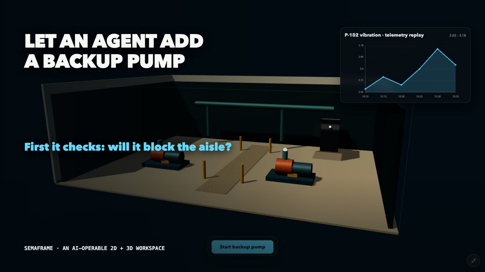
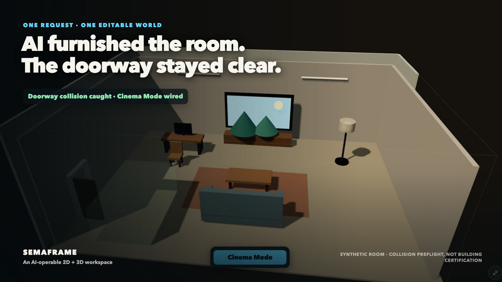
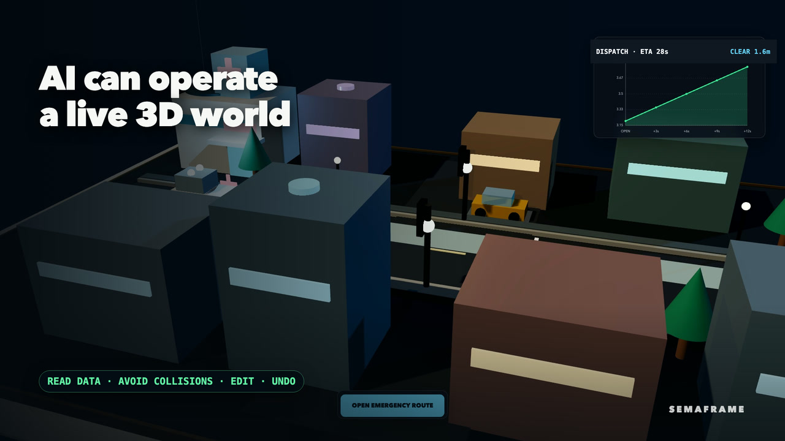
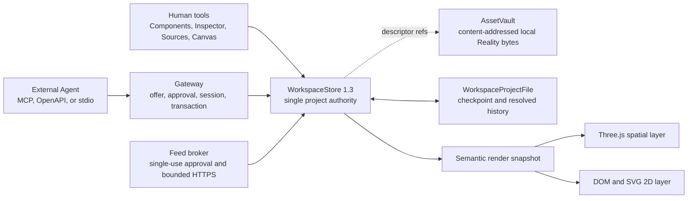

# SemaFrame

<p align="center">
  
</p>

<p align="center">
  <a href="https://github.com/riseagain1/semaframe/actions/workflows/ci.yml"></a>
  <a href="https://github.com/riseagain1/semaframe/releases/latest"></a>
</p>

> **Build spaces agents can understand.**
>
> A browser-authoritative, agent-operated workspace where 2D interfaces, 3D space, live data, interaction, animation, collision, and bounded physics share one state model.

SemaFrame turns a browser canvas into a programmable visual workspace. A person or an approved external Agent can create spatial scenes, dashboards, controls, simulations, data panels, websites, charts, timers, checklists, and declarative custom components—then connect them through typed actions and events.

The central idea is simple: there is one authoritative `WorkspaceStore`. The UI, Agent API, data bindings, physics queries, project history, and hybrid renderer all operate on that same revisioned state. There is no hidden model-owned scene and no separate legacy Compose authority.

## See SemaFrame in action

These three silent-first English films show the product through ordinary-language outcomes. Click any poster to watch; sound is optional because the complete story is on screen.

<table>
  <tr>
    <td width="33%" valign="top">
      <a href="https://github.com/riseagain1/semaframe/releases/download/demo-gallery-v1/semaframe-realityops-v2-en.mp4"></a><br />
      <strong>Build a backup pump</strong><br />
      An Agent assembles editable parts, catches a blocked aisle, corrects the placement, wires data and controls, preserves history, and exports the model.<br /><br />
      <a href="https://github.com/riseagain1/semaframe/releases/download/demo-gallery-v1/semaframe-realityops-v2-en.mp4">▶ Watch film</a>
    </td>
    <td width="33%" valign="top">
      <a href="https://github.com/riseagain1/semaframe/releases/download/demo-gallery-v1/semaframe-living-room-public-demo-en.mp4"></a><br />
      <strong>Redesign a living room</strong><br />
      One request creates office and cinema spaces, rejects a sofa that blocks the doorway, routes one 2D control into the 3D room, and remains undoable.<br /><br />
      <a href="https://github.com/riseagain1/semaframe/releases/download/demo-gallery-v1/semaframe-living-room-public-demo-en.mp4">▶ Watch film</a>
    </td>
    <td width="33%" valign="top">
      <a href="https://github.com/riseagain1/semaframe/releases/download/demo-gallery-v1/semaframe-emergency-city-v4-en.mp4"></a><br />
      <strong>Open an emergency route</strong><br />
      AI reads dispatch data and scene semantics, rejects a collision, proposes safe endpoints, and one human-confirmed click commits 11 coordinated actions.<br /><br />
      <a href="https://github.com/riseagain1/semaframe/releases/download/demo-gallery-v1/semaframe-emergency-city-v4-en.mp4">▶ Watch film</a>
    </td>
  </tr>
</table>

The rooms, city, and feeds are deterministic synthetic evidence—not field scans, live infrastructure, or engineering certification. Video binaries live in the [Demo Gallery release](https://github.com/riseagain1/semaframe/releases/tag/demo-gallery-v1); Remotion source, captions, contracts, and captured evidence remain reviewable in [`video/`](./video/README.md). The [original 78-second launch tour](https://github.com/riseagain1/semaframe/releases/download/v0.2.0/semaframe-demo.mp4) remains available in the [v0.2.0 release](https://github.com/riseagain1/semaframe/releases/tag/v0.2.0).

## Next / unreleased

The next public Agent contract keeps the v0.3 modeling and Reality foundation, adds editable B-rep authoring and a production-oriented CAD handoff, and closes three operational loops:

| Capability | What it adds |
| --- | --- |
| **Editable CAD parts** | Versioned SI parameters, bounded constraint sketches, ordered feature history, real OCCT B-rep evaluation, host-authored evidence, human Inspector editing, and atomic Agent authoring |
| **Verified CAD handoff** | A deterministic ZIP with a non-unioned AP242/XCAF assembly, names/colors/occurrences, OpenUSD scene layer, editable SemaFrame sidecar, limitations report, and geometric OCCT re-import proof |
| **Exact approved feed readback** | A revision-preserving `read_workspace_resource_snapshot` tool for canonical inline or HTTP-feed snapshots, gated by `workspace:read` plus non-default `effect:data_read` approval and bounded to exact non-secret results |
| **Routed spatial movement** | A typed `move_to` action for entities, exact primitives, CAD parts, and assemblies, with scale preservation, atomic event fan-out, endpoint collision and enforced-physics validation, and ordinary renderer transitions |
| **Registry-drift recovery** | Verified replay rebases registry-derived command and history digests when append-only built-in manifests advance, so valid project-schema 1.3 files reopen without weakening history validation |

The development surface is now Workspace Protocol 1.3 with project schema 1.4, 19 MCP tools, Agent Guide 2.8, MCP server 1.8.0, Agent Gateway OpenAPI 1.1.0, and SemaFrame Spatial Graph 3.2. These values describe `main` after this change, not the published v0.3.0 tag.

## What's new in v0.3

v0.3 moves SemaFrame beyond scene assembly into an Agent-native modeling and Reality workspace, while keeping the browser and one revisioned `WorkspaceStore` authoritative.

| New capability | What it adds |
| --- | --- |
| **Parametric modeling** | Exact SI primitives, editable multipart assemblies, collision-aware placement, numeric human controls, and immutable reusable model definitions with ordinary editable instances |
| **CAD and interchange** | Deterministic OpenUSD USDA, bounded Manifold STL/OBJ, and a real OpenCascade AP242 STEP subset running in lazy, cancellable Workers |
| **Gaussian Splat Reality Layer** | Human or approved-Agent import of PLY, SPZ v4, and SOG v2 captures with direct A/B surface-pick calibration, content-addressed browser storage, digest relinking, and editable semantic engineering proxies |
| **Agent-native spatial workflow** | SSG 3.1 spatial understanding, 18 approval-gated MCP tools, secure streaming asset ingress, collision and bounded-physics evidence, undo/redo, save/reopen, live data bindings, and typed 2D-to-3D actions |

Together, these capabilities support one inspectable workflow: import captured context, build exact semantic parts and proxies, check placement and feasibility, connect live controls, publish reusable models, preserve the result, and export standard formats—without taking editability away from the person using the workspace.

[Read the complete v0.3.0 release notes](./docs/release-v0.3.0.md).

## Contents

- [See SemaFrame in action](#see-semaframe-in-action)
- [Next / unreleased](#next--unreleased)
- [What's new in v0.3](#whats-new-in-v03)
- [Why SemaFrame](#why-semaframe)
- [A practical Jarvis-like workspace](#a-practical-jarvis-like-workspace)
- [What it can do](#what-it-can-do)
- [Quick start](#quick-start)
- [First Agent connection](#first-agent-connection)
- [Product tour](#product-tour)
- [Core model](#core-model)
- [Parametric modeling and interchange](#parametric-modeling-and-interchange)
- [Reality capture and Gaussian splats](#reality-capture-and-gaussian-splats)
- [Spatial understanding and physics](#spatial-understanding-and-physics)
- [Data feeds and websites](#data-feeds-and-websites)
- [Agent integration](#agent-integration)
- [Protocol and persistence](#protocol-and-persistence)
- [Security and trust model](#security-and-trust-model)
- [Current boundaries](#current-boundaries)
- [Architecture and code map](#architecture-and-code-map)
- [Development and verification](#development-and-verification)
- [Contributing and security](#contributing-and-security)
- [License](#license)

## Why SemaFrame

Most Agent interfaces expose documents, forms, or a chat transcript. SemaFrame instead exposes a persistent visual world with explicit geometry, data, behavior, history, and permissions.

It is designed around four principles:

1. **One shared authority.** Human edits and Agent transactions modify the same Workspace, so the rendered result, saved project, undo history, and Agent inspection cannot silently diverge.
2. **Semantic objects, not pixels.** Components retain typed props, durable state, placement, actions, events, bindings, collision, physics intent, provenance, and versioned manifests.
3. **Inspect before acting.** Agents receive revision-bound component, space, placement, and physics projections rather than guessing from a screenshot alone.
4. **Capability-based control.** Connections, approvals, sessions, scopes, transactions, feed fetches, and host signals are explicit and bounded.

SemaFrame is useful for Agent-driven dashboards, simulation controls, spatial planning, interactive explainers, mixed 2D/3D prototypes, operational views, and feasibility preflight. It is not a general web browser, an unrestricted code sandbox, or a full engineering solver.

## A practical Jarvis-like workspace

Imagine an assistant that does more than chat: it can inspect a shared 2D/3D workspace, understand where objects are, read approved live data, check collisions and physical support, and operate controls through explicit permissions.

For example, an Agent could inspect a workshop layout through the SemaFrame Spatial Graph, place a machine without intersecting existing equipment, attach a live telemetry panel, connect a 2D emergency-stop button to a 3D animation, run a bounded stability preflight, and leave every action visible in the same undoable project history.

SemaFrame provides this inspectable spatial substrate. It is not an autonomous operating system or a full engineering simulator: the browser remains authoritative, actions are scoped, and physical results are deliberately bounded.

## What it can do

| Area | Current capability |
| --- | --- |
| Universal canvas | Mix navigable Three.js content with DOM/SVG panels on one canvas |
| Component system | 20 versioned built-ins plus bounded Agent-defined declarative recipes |
| Parametric modeling | Exact SI primitives plus editable OCCT CAD parts with parameters, bounded constraint sketches, ordered features, assemblies, immutable reusable models, and numeric Inspector controls |
| Reality capture | Local PLY, SPZ v4, and SOG v2 Gaussian splats with direct two-point metric calibration, content-addressed storage, missing-byte relink, and editable semantic proxies |
| Solid export | OpenUSD USDA assemblies, bounded Manifold STL/OBJ solids, legacy fused STEP, and a verified non-unioned AP242/XCAF CAD handoff package |
| Spatial reasoning | Revision-bound SemaFrame Spatial Graph 3.2 with transforms, analytic and exact CAD evidence, visual-only Reality nodes, semantic proxies, bounds, colliders, support, and intersection relations |
| Collision | Asset bounds, explicit boxes, and compound oriented-box colliders with independent enable/trigger controls |
| Physics | Optional static/dynamic/kinematic intent, mass and material properties, constraints, stability reports, placement preflight, and deterministic settle previews |
| Data | Local JSON/CSV snapshots and approved public HTTPS JSON/CSV/RSS/Atom feeds |
| Projection | Schema-checked resource bindings into writable component props without mutating canonical props |
| Interaction | Typed actions and events routed atomically across 2D and 3D components |
| Animation | Discoverable spatial clips, durable playback state, bounded transitions, completion events, and reduced-motion support |
| Web and media | User-activated sandboxed website panels plus normalized YouTube, Vimeo, MP4, and WebM video |
| Agent control | Approval-gated Streamable HTTP MCP, OpenAPI 3.1, and a stdio bridge |
| Persistence | Direct Workspace project files with deterministic replay, migration, undo/redo, and validated provenance |

The built-in component registry contains:

- spatial, modeling, and reality: `stage-3d`, `spatial-entity`, `spatial-primitive`, `cad-part`, `model-assembly`, `gaussian-splat`;
- layout: `group`, `panel`;
- content: `text`, `image`, `annotation`, `document`;
- media and web: `video-player`, `web-panel`;
- data: `data-panel`, `chart`, `table`;
- controls and utilities: `button`, `timer`, `checklist`.

## Quick start

### Requirements

- Node.js 22.12 or newer
- npm
- a modern browser with WebGL support
- an MCP-capable Agent client for external Agent control

### Install and run

```bash
git clone https://github.com/riseagain1/semaframe.git
cd semaframe
npm install
npm run dev
```

Open [http://127.0.0.1:4173](http://127.0.0.1:4173).

`npm run dev` starts both Vite and the loopback Agent Gateway. The main local endpoints are:

| Service | URL |
| --- | --- |
| Browser app | `http://127.0.0.1:4173` |
| Agent Gateway | `http://127.0.0.1:8788` |
| OpenAPI document | `http://127.0.0.1:8788/openapi.json` |

Useful alternatives:

```bash
npm run dev:vite          # browser UI only
npm run agent:gateway     # one-shot gateway
npm run agent:mcp         # stdio MCP bridge
npm run build             # production build
npm run preview           # preview the production bundle
```

### What appears on first launch

Before a connection completes, SemaFrame intentionally shows only the Agent connection interface—not an empty editable Workspace. The existing project remains preserved, but the canvas is unlocked only after an approved Agent completes the instruction handshake.

This makes ownership explicit: the browser is authoritative, while the external Agent receives scoped access to the open Workspace.

## First Agent connection

Any Streamable HTTP MCP-capable client can connect:

1. Start SemaFrame with `npm run dev`.
2. Enable Agent control and copy the short-lived connection URL.
3. Add that URL as an MCP server or connector in the external client.
4. The client reads `workspace://instructions/v1` and calls `get_workspace_instructions` first.
5. SemaFrame displays the client's name, fingerprint, requested scopes, and destructive capabilities.
6. Approve the request in the authoritative browser.
7. The Agent inspects and edits the same open project through revision-bound transactions.

The connection URL contains a random offer identifier, not authority. The first instruction request creates a separate approval claim. Approval, session, and transaction capabilities are never placed in the URL or project file.

Incomplete expired or failed offers can be replaced with **Create fresh URL**. **Revoke pairing** invalidates the current offer and live sessions. If the authoritative browser disappears, the engine becomes unavailable rather than creating a second hidden Workspace.

## Product tour

After the handshake, the Workspace exposes five primary surfaces:

- **Components** creates registered 2D and 3D components.
- **Inspector** edits the selected component, geometry, visual effects, collision, physics, actions, and data bindings.
- **Sources** previews, creates, refreshes, binds, rebinds, and removes data resources.
- **Canvas** provides direct selection, move, resize, frame, reset, zoom, and presentation controls.
- **Agent controls** show connection state, approval requests, active identity, recent history, and revocation actions.

Project controls provide **New**, **Open**, **Save**, **Undo**, and **Redo**.

A fresh project contains zero components. `canvas2d` and `viewport` content does not need a Stage. Create exactly one `stage-3d` before adding content in `world3d`, `surface`, or `billboard` space.

### Placement spaces

| Space | Meaning |
| --- | --- |
| `world3d` | Spatial content inside the Stage |
| `canvas2d` | Content on the zoomable 2D plane |
| `surface` | A 2D component attached to a named component surface |
| `billboard` | Screen-facing content anchored to a 3D target |
| `viewport` | Fixed HUD-style content in screen pixels |

Scroll or pinch over the background to zoom around the pointer. `viewport` components stay fixed. **Frame all** recovers both layers, while **Reset view** restores the canonical camera. Navigation and full-screen presentation are browser-local: they do not alter project revision, dirty state, saved files, history, or Agent authority.

## Core model

Every Workspace object is a versioned component with:

- a stable ID and pinned component type, version, and digest;
- typed props and durable state;
- placement and geometry;
- visual effects and visibility;
- locks and provenance;
- resource bindings;
- declared actions and events;
- optional collision and physics attributes for spatial entities, exact primitives, and CAD parts.

The engine validates operations against the pinned manifest. It does not silently clamp malformed commands or reinterpret stale component definitions.

### Geometry, effects, and animation

Each manifest declares supported placements and a resize policy. Geometry uses one of four closed models: `box2d`, `scale3d`, `stage_dimensions`, or `none`.

All components support renderer-neutral opacity, emissive color/intensity, glow, visibility actions, and bounded transitions. A transition has duration, optional delay, and a closed easing value. The semantic state commits once; DOM and Three.js interpolate the resulting revision without writing per-frame history and honor reduced-motion preferences.

Spatial components expose discoverable animation clips and durable `play_animation` and `stop_animation` actions. Playback starts only while both the entity and Stage are visible. Hiding or collapsing either one deterministically stops active playback. Renderer completion is a host-only signal and cannot be forged by an Agent or unattended event route.

### Cross-component actions

`connect_event` routes declared semantic actions in the same atomic Workspace commit as the source event. Routes are cycle-checked, bounded, deterministically ordered, and permission-checked again when they execute.

Examples include:

- a 2D button starting a supported 3D animation;
- a 2D control moving one or several 3D entities to validated endpoints;
- double-click or Enter/Space on a spatial object showing a 2D panel;
- a timer completion adding an item to a checklist;
- a selected chart point forwarding a schema-identical payload to another component.

Connections may use static validated input or forward the complete event payload when the event and action schemas are exactly identical. Arbitrary expressions and JavaScript are never evaluated. Privileged network, external-write, and extension effects cannot be wired for unattended execution.

The latest `spatial-entity`, `spatial-primitive`, `cad-part`, and `model-assembly` manifests expose a typed `move_to` action. It preserves scale and reuses ordinary Stage, placement-lock, endpoint-collision, and enforced-physics validation; one invalid target rejects the complete source action and its fan-out. Coordinates are world coordinates for a root component and parent-local coordinates for a child, matching ordinary `world3d` placement. A component may receive only one `move_to` target per revision; duplicate explicit or routed targets reject the whole commit. A transition animates the renderer from the previous revision to the committed endpoint—it is not route planning, swept-path collision detection, continuous physics, or a waypoint sequence.

### Agent-defined components

An approved Agent can define a bounded `recipe.*` component type, inspect its canonical digest, and create instances in a later transaction.

Recipes can declare schemas, defaults, writable props, actions, events, placements, resize policies, and a bounded node tree. The renderer accepts only a closed data vocabulary: stacks, grids, overlays, scrolling, text, shapes, images, icons, charts, tables, asset placeholders, buttons, sliders, toggles, inputs, and timers.

Recipes cannot execute HTML, JavaScript, JSX, iframe code, shaders, network requests, or arbitrary packages. Untrusted schemas reject regular expressions, references, unbounded combinators, and other synchronous validation-amplification paths.

## Parametric modeling and interchange

SemaFrame now has a closed modeling contract rather than inferring geometry from an asset label. A `spatial-primitive` stores one exact SI-metre descriptor:

- box dimensions;
- sphere radius;
- cylinder or cone radius, height, and axis;
- capsule radius, cylindrical height, and axis; or
- plane dimensions and normal axis.

The same canonical descriptor produces render geometry, local bounds, analytic collider evidence, volume, SSG output, physics evidence, persistence digest, and export geometry. Primitive scale remains identity so dimensions cannot silently disagree with a renderer transform.

A `cad-part` stores a versioned `CadPartDefinition` rather than a baked triangle mesh. Its SI parameter expressions drive bounded line/circle/arc constraint sketches and an ordered feature history. CAD V1 evaluates sketch profiles, extrude, revolve, boolean union/cut/intersection, through/blind holes, and explicit `all_edges` fillet/chamfer with OpenCascade. Shell, sweep, loft, and linear/circular pattern records are reserved in the schema but currently fail explicitly at evaluation; they never masquerade as completed geometry. Over-constrained sketches and invalid B-reps also fail closed, while under-constrained sketches remain valid with a recorded warning.

Successful evaluation records only compact, digest-matched evidence—body identity, exact B-rep status, bounds, volume, area, centre of mass, evaluator versions, and diagnostics—in the Workspace. Transferable render meshes stay outside persistence. The human Inspector provides a dimensioned plate/through-hole starter, feature history, measurements, manufacturing identity, and an advanced document editor. An Agent submits the same semantic document; the authoritative host evaluates it before commit, overwrites forged digest/evidence, and leaves revision, undo history, and the previous valid solid untouched if evaluation fails.

Serialized evidence is not trusted merely because its JSON fields and 32-bit definition digest are self-consistent. Before an external or recovery project containing CAD can replace the current Workspace, the browser rebuilds every unique CAD definition in a disposable Worker and compares the complete evidence record. Missing Worker isolation, a resource cap, a timeout, or any measurement mismatch rejects the open and leaves the current project unchanged.

A `model-assembly@2` is an editable transform root with `external_only`, `all`, or `none` collision policy, optional part/material identity, and validated fixed/revolute/slider/planar mate metadata. Mate endpoints must stay inside the assembly subtree; datum and topology roles are allowed only on CAD parts. These mates preserve intent for Agents and in the editable handoff sidecar; STEP occurrences do not contain downstream-native mate constraints, and SemaFrame does not yet have a kinematic assembly solver. Reparenting can preserve world or local transforms explicitly.

The **Models** panel publishes an assembly subtree as an immutable, digest-pinned model definition. V2 definitions preserve editable CAD documents, logical/part/material identity, and remapped assembly mate endpoints. An instance is materialized as an ordinary editable assembly, primitive, and CAD-part tree—not a hidden proxy. SemaFrame chooses a collision-safe starting location, reserves every ID atomically, and preserves the source definition when an instance is edited. Agents use the same `publish_model`, `inspect_workspace_model`, `instantiate_model`, and `delete_model_definition` contract with revision, scope, and ID-reservation checks.

### Export paths

| Format | Implementation | Intended use |
| --- | --- | --- |
| USDA | Deterministic OpenUSD layer, metres and Y-up, stable prim IDs, Xforms, analytic primitive geometry/materials, plus CAD hierarchy, transforms, and visibility | DCC, simulation, and spatial interchange; exact CAD geometry remains in STEP and the complete CAD recipe/material record in the SemaFrame sidecar |
| STL / OBJ | Bounded Manifold 3.5.1 WebAssembly union with watertight/manifold diagnostics and hard vertex/triangle/output caps; STL coordinates are conventional millimetres, OBJ coordinates remain metres | Mesh-solid handoff and 3D-print prototyping |
| STEP | Legacy real OpenCascade fused B-rep through Replicad, AP242 Part 21 in metres | One-solid handoff for the box/sphere/cylinder and uniform-transform subset |
| CAD package | Deterministic ZIP containing a non-unioned AP242/XCAF assembly, names/colors/product occurrences, USDA, full editable SemaFrame definition sidecar, machine-readable limitations report, hashes, and a geometric OCCT re-import proof | Continue detailed work in downstream CAD while retaining separate solids and the original Agent-editable recipe |

The production browser paths for CSG, CAD evaluation, and CAD handoff run in disposable, lazy-loaded Workers. Cancellation or a time limit terminates the Worker, which is the only reliable hard stop while synchronous WebAssembly geometry code is running. A headless Agent adapter without a disposable Worker fails CAD evaluation closed instead of falling back to in-process OCCT; controlled tests may inject a direct kernel explicitly. The OpenCascade runtime is served as one fingerprinted local WASM asset; it is not fetched from a CDN. The handoff Worker re-imports its own STEP and verifies solid count, aggregate world bounds, and volume before a package can be downloaded. Repeated exports of the same canonical definition with the pinned runtime are byte-identical.

This makes SemaFrame useful for accurate blockouts, rooms, furniture, fixtures, equipment envelopes, machined-part first passes, spatial assemblies, collision/stability preflight, and reducing the amount of manual rebuilding before downstream CAD refinement. Dimensions and evaluated solids are exact to the supplied constraints and OpenCascade model—not proof of manufacturing tolerance, survey accuracy, or fitness for purpose. It is deliberately described as **Agent-native spatial modeling with light parametric CAD**, not a replacement for a mature mechanical CAD/PLM stack. There is not yet robust persistent per-face naming, arbitrary edge selection, evaluated shell/sweep/loft/pattern features, GD&T/PMI, drawings, STEP import, vendor-native feature-tree generation, a kinematic mate solver, or FEA certification.

## Reality capture and Gaussian splats

The Reality Layer adds captured environments and objects without pretending that a probabilistic visual reconstruction is a CAD solid. A person can import a local PLY Gaussian splat, SPZ v4 file, or SOG v2 package from the **Reality** panel. An approved Agent with `asset:import` can import a file the user supplied to it through a one-time streaming upload grant. The gateway accepts neither an arbitrary local path nor a source URL, and raw bytes are never embedded in MCP JSON.

Every import is independently preflighted and SHA-256 hashed in the authoritative browser before it enters the local `AssetVault`. The vault uses origin-private file storage when available and otherwise stores a sanitized Blob in IndexedDB. Workspace state contains only a content-addressed `RealityAssetDescriptor`: format, byte and splat counts, safe coordinate/bounds metadata, digest, and `engineeringAuthority: "visual_only"`. Source file names, local paths, Blob URLs, upload bearers, and raw bytes are excluded from project JSON and Agent inspection.

A `gaussian-splat@1.0.0` component supplies editable placement, quality, visual effects, and one explicit calibration mode:

- `uncalibrated` preserves source units and does not claim metric bounds;
- `metadata-declared` records a declared unit and metres per source unit; or
- `reference-distance` records the measured source distance and real-world distance used to derive scale.

For reference-distance calibration, the Inspector can start a direct two-point pick on the visible Gaussian surface. The person chooses A and B with the pointer (or aims at viewport center and presses Enter), sees ephemeral markers and the measured source-space span, then enters the one known real distance and applies it. The pick is sampled from Spark's current Gaussian LOD, so it is deliberately labeled as a visual estimate—not survey or CAD measurement. Escape, selection changes, renderer replacement, or applying the calibration clears the ephemeral measurement session; it never becomes hidden authoritative geometry.

Source coordinates are mapped explicitly into SemaFrame's right/up/back (`RUB`) basis. Spark 2.1 renders the splat inside the existing Three.js scene so it participates in depth, selection bounds, visibility, glow, and context recovery. If local bytes are absent after opening a project on another browser, SemaFrame shows a deterministic placeholder. **Relink** accepts only a file with the descriptor's exact digest.

Reality data never owns collision, mass, support, constraints, CAD export, or structural feasibility. For an engineering-aware digital twin, link the splat to one or more editable `spatial-primitive`, `cad-part`, `spatial-entity`, or `model-assembly` components through `semanticProxyIds`. SSG 3.2 exposes the splat as a `reality` node plus `represented_by` / `proxy_for` relations; the proxies remain the sole engineering authority. A utility-pole capture, for example, can provide visual field context while an exact cylinder/CAD/assembly proxy drives clearance, collision, stability, and export.

Agent import is deliberately split into capabilities:

1. call `begin_workspace_asset_import` with the current Workspace ID, stable request ID, exact byte length, media type, and SHA-256;
2. stream the original bytes once to the returned exact `PUT` URL and bearer;
3. call `complete_workspace_asset_import` so the browser preflights, stores, and registers the candidate;
4. use `inspect_workspace_asset` for exact safe descriptor rediscovery; then
5. create a normal `gaussian-splat` component in a prepared Workspace batch: map returned `asset_ref.asset_id` to `props.assetRef.assetId`, copy the digest exactly, and provide explicit calibration.

Current import limits are 256 MiB, 4 million splats, and 128 registered descriptors per Workspace. Project files are metadata/reference packages, not portable Reality Asset archives; copying a project to another browser may require same-digest relinking.

## Spatial understanding and physics

### SemaFrame Spatial Graph

`inspect_workspace_space` returns **SemaFrame Spatial Graph 3.2 (SSG)** in `data.spatial_graph`: a revision-bound, model-readable projection of the open Workspace. It includes:

- stable prim paths and component identity;
- parent-aware world transforms;
- explicit asset, primitive, CAD, assembly, and visual-only Reality node kinds;
- exact primitive parameters, digest, dimensions, local bounds, volume, analytic collider, and material summary;
- exact CAD definition/evaluator identity, body count, local bounds, B-rep volume/area, and feature diagnostics;
- assembly collision policy, model reference, ancestry, and aggregate descendant bounds;
- Reality Asset identity, calibration, metric-bounds status, and semantic-proxy relations without local byte disclosure;
- asset-derived and component-derived world bounds;
- exact collider parts;
- rigid-body intent;
- containment, intersection, contact, and support relations;
- optional deltas through `since_revision` when the change is unambiguous.

SSG is derived JSON, not a second scene database and not a Pixar OpenUSD file. The authoritative data remains the Workspace. The names USD and OpenUSD are reserved for Pixar's interchange format.

### Collision

Current spatial entities, parametric primitives, and evaluated CAD parts support:

- asset-derived bounds;
- one explicit box collider; or
- up to 16 compound oriented-box parts.

Parametric `asset_bounds` comes from the exact geometry descriptor, and CAD `asset_bounds` comes from verified OCCT B-rep bounds—not an asset approximation. SSG preserves analytic primitive evidence and exact CAD measurements, while the current feasibility narrow phase conservatively tests their oriented bounding volumes. Assembly policy can ignore internal part/part contacts while retaining external collisions, include all contacts, or exclude the assembly subtree from collision feasibility.

Collision can be enabled or disabled independently of physics. A collider may also be a trigger. Solid overlaps reject the entire atomic update; touching faces and trigger volumes are represented explicitly. Parent/child attachment can use a safety margin, but true solid penetration remains invalid.

### Physics attributes

Physics is optional per component. Turning the physics master switch off preserves configured values while excluding the body from support, constraint, and settle participation.

Supported attributes include:

- static, dynamic, and kinematic body type;
- mass and center-of-mass offset (applied from the evaluated geometric centre of mass for CAD parts, otherwise from resolved bounds);
- friction, restitution, and gravity scale;
- report or enforce stability mode;
- up to 16 fixed, hinge, slider, or ball constraints.

`inspect_workspace_physics` reports contact geometry, grounded load paths, world center of mass, stability margin, collisions, and conservative joint equilibrium. `query_stable_placement` preflights a candidate placement. `simulate_workspace_physics` runs a bounded deterministic fixed-step vertical-drop preview and returns absolute placement proposals plus explicit modeled and ignored properties.

This can test layout feasibility, collision-free assembly, quasi-static support, center-of-mass stability, simple constraints, and conservative settling. It does **not** prove material strength, stress, fracture, fatigue, frictional sliding, bounce, angular dynamics, soft bodies, fluids, manufacturing tolerances, or general engineering feasibility.

## Data feeds and websites

### Data resources and bindings

Resources hold a connector type/version, safe public configuration, last-good immutable snapshot, content hash, retrieval time, refresh policy, and bounded provenance. Credentials are never persisted.

Two data paths are available:

- `inline.snapshot@1.0.0` accepts bounded local or Agent-submitted JSON/CSV-like data without network execution.
- `http.feed@1.0.0` lets a person preview a public HTTPS JSON, CSV, RSS, or Atom endpoint through the trusted loopback broker.

`bind_resource` projects a snapshot value into a writable component prop through closed transforms. Binding `$.labels` and `$.series` produces a chart; binding `$` to `data-panel.data` renders a general feed as a bounded table, card list, or inert JSON view. Projection does not mutate canonical component props or create a Workspace revision.

The broker sends no cookies, credentials, custom headers, request body, or ambient browser authority. It validates DNS and every redirect, blocks private/link-local/special-use targets, pins TLS to the validated address, and bounds total time, redirects, concurrency, compressed and decoded size, XML structure, output schema, and credential-like content.

Interval and on-open automation is authorized only by in-memory consent after a successful preview and matching save. Opening or restoring an untrusted project cannot silently start network reads. Changing the URL, format, policy, project, or resource revokes that consent.

Agents can inspect and bind an existing host feed, but cannot mint feed approval, initiate network reads, forge host provenance, or create `http.feed` resources. Exact current values are available through `read_workspace_resource_snapshot` only when the approved session explicitly requests both `workspace:read` and the non-default `effect:data_read` scope. The read is limited to canonical host-normalized `inline.snapshot@1.0.0` and `http.feed@1.0.0` snapshots, never returns connector configuration or secret references, never refreshes or contacts the source, and never changes the Workspace revision. Results are exact up to 1 MiB; larger snapshots fail explicitly instead of being truncated. Resource metadata, output schema, snapshot data, and provenance remain untrusted external data.

### Website panels

`web-panel` embeds an approved public HTTPS page in a resizable 2D panel. It starts as a no-network facade. A person must choose **Load website** for that exact component instance; URL changes, project replacement, component recreation, or unload require another gesture.

The Store rejects HTTP, local/private/special-use targets, custom ports, embedded credentials, and recognized signed, session, login, reset, invitation, or authorization capabilities. The frame uses an opaque-origin `allow-scripts` sandbox with no forms, same-origin authority, popup, top navigation, referrer, or ambient browser permissions.

Not every site allows embedding. CSP or `X-Frame-Options` may refuse the frame, and the browser does not provide a reliable cross-origin success signal. **Open in browser** is the explicit fallback. Truly arbitrary browsing requires a separate trusted browser or native webview surface.

### Video panels

`video-player` accepts normalized YouTube, Vimeo, and public HTTPS MP4/WebM sources. It also begins as a facade and creates no iframe or media element until a person chooses **Load video**. Private, DRM-protected, owner-disabled, expired, or unsupported media can remain unavailable. Pasted iframe HTML and credential-bearing URLs are rejected.

## Agent integration

SemaFrame exposes exactly 19 Workspace tools:

| Phase | Tool |
| --- | --- |
| Handshake | `get_workspace_instructions` |
| Inspect | `inspect_workspace` |
| Inspect | `inspect_workspace_component` |
| Data read | `read_workspace_resource_snapshot` |
| Inspect | `inspect_workspace_asset` |
| Inspect | `inspect_workspace_model` |
| Inspect | `inspect_workspace_space` |
| Inspect | `query_spatial_placement` |
| Inspect | `inspect_workspace_physics` |
| Inspect | `query_stable_placement` |
| Inspect | `simulate_workspace_physics` |
| Asset import | `begin_workspace_asset_import` |
| Asset import | `cancel_workspace_asset_import` |
| Asset import | `complete_workspace_asset_import` |
| Mutate | `begin_workspace_update` |
| Mutate | `submit_workspace_batch` |
| History | `undo_workspace_batch` |
| History | `redo_workspace_batch` |
| Events | `read_workspace_events` |

The normal Agent flow is:

1. obtain approval through `get_workspace_instructions`;
2. retain the returned `session_token` and map `guide_digest` to the `instruction_digest` input used by subsequent tools;
3. inspect the Workspace, exact components/assets/models, spatial projection, or physics report;
4. begin an update against an exact revision and registry digest;
5. submit one bounded atomic operation batch;
6. retry safely with the same request ID, or inspect the new revision before continuing.

Voice, realtime, and multimodal clients use this same contract. Partial model output stays in client-side preview state; only final intent becomes a Workspace transaction. SemaFrame owns validation, rendering, history, permissions, and persistence. It does not bundle a model, speech recognizer, or voice transport.

For non-MCP clients, OpenAPI 3.1 is published at `http://127.0.0.1:8788/openapi.json` with bearer-authenticated `/v1/workspace/*` routes. `npm run agent:mcp` exposes the same Workspace surface over stdio.

## Protocol and persistence

### Workspace Protocol 1.3

The closed protocol supports 24 operations:

- lifecycle: `define_component_recipe`, `create_component`, `update_component`, `upgrade_component_manifest`, `delete_component`;
- layout: `place_component`, `resize_component`, `attach_component`, `detach_component`;
- behavior: `set_component_visual_effects`, `invoke_component_action`;
- data: `upsert_resource`, `delete_resource`, `bind_resource`, `unbind_resource`;
- Reality Asset metadata: host-only `register_reality_asset`, `delete_reality_asset`;
- wiring: `connect_event`, `disconnect_event`;
- reusable modeling: `publish_model`, `instantiate_model`, `delete_model_definition`;
- metadata and reset: `present_view`, `clear_workspace`.

Every batch carries exact Workspace identity, base revision, registry digest, request ID, and a bounded operation list. Validation and reduction occur on a draft. Any failure leaves authoritative state unchanged. Identical retries are idempotent; changed retries, stale revisions, unknown fields, unpinned digests, invalid geometry, collisions, and missing permissions fail closed.

Saved components remain pinned to their manifest version. `upgrade_component_manifest` explicitly moves a compatible older built-in to the latest exact reference as one atomic, undoable, replayable operation. Workspace project-schema 1.0 through 1.3 migrations remain supported.

Protocol source of truth:

- [`src/workspace/protocol/workspaceProtocol.schema.json`](src/workspace/protocol/workspaceProtocol.schema.json)
- [`src/workspace/protocol/workspaceTypes.ts`](src/workspace/protocol/workspaceTypes.ts)
- [`src/workspace/agents/contracts.ts`](src/workspace/agents/contracts.ts)

### Project files

**Save** exports one direct `WorkspaceProjectFile` with `formatVersion: "1.0"`. It contains:

- the checkpoint and current Workspace state;
- recipes, pins, geometry, state, locks, aliases, and provenance;
- resources, bindings, event connections, and shared views;
- safe Reality Asset descriptors and digest-pinned component references, but never their binary payloads;
- monotonic component and event counters;
- resolved command and event history for deterministic replay.

Open validates the closed schema, registry digests, counters, command continuity, resource invariants, and replay before replacing the current project. It never reruns actions, models, Reality Asset imports, or connector reads.

Projects from the removed pre-Workspace runtime and its dual-envelope format are intentionally unsupported. Local recovery uses the same Workspace-only representation. Provider credentials, feed approvals, MCP approvals, session tokens, and transaction tokens are never saved.

Project schema: [`src/workspace/persistence/workspaceProject.schema.json`](src/workspace/persistence/workspaceProject.schema.json).

### Application limits

Hard limits bound main-thread work, memory use, persistence, and replay:

| Resource | Limit |
| --- | ---: |
| Components | 2,000 |
| Data resources | 1,000 |
| Event/data connections | 5,000 |
| Aliases | 4,000 |
| Shared views | 500 |
| Agent-defined recipes | 200 |
| Registered Reality Assets | 128 |
| One Reality Asset binary | 256 MiB / 4 million splats |
| Public history summaries | 512 |
| Recent undoable commands | 64 |
| Idempotency ledger entries | 4,096 |
| Project file size | 25 MiB |

Older commands are compacted into a checkpoint rather than allowing undo memory to grow without bound.

## Security and trust model

SemaFrame treats the browser as the authoritative host and external clients as scoped callers.

Important boundaries include:

- the gateway binds to loopback and starts disabled;
- connection URLs identify offers but do not carry session authority;
- approvals are bound to the instruction surface, client identity, requested scopes, and browser lease;
- mutation requires a scoped session plus a short-lived revision-bound transaction;
- capability values are redacted from diagnostics and excluded from projects and recovery;
- Agent Reality imports require `asset:import`, an exact user-provided file digest, a one-time upload grant, browser-side preflight, and a browser-owned content-addressed vault;
- connector network reads require a person-mediated single-use approval;
- resource schemas, payloads, paths, transforms, and provenance are bounded and validated;
- feeds reject private networks, credential-like URLs/content, unsafe redirects, excessive bodies, and long-lived sockets;
- web and video content begins behind an explicit user-activation facade;
- event routes reauthorize their target actions and cannot call non-routable host signals;
- declarative recipes have no arbitrary code or network execution;
- project replacement invalidates ephemeral web activation, feed automation consent, and in-flight refresh work.

This is an application-level local capability model, not an operating-system security boundary. A malicious process already able to impersonate the local browser and access loopback is outside the model.

## Current boundaries

SemaFrame deliberately does not claim the following:

- **Not any website.** Remote sites may reject framing; authenticated arbitrary browsing needs a trusted browser surface.
- **Not any API.** Host feeds are public HTTPS JSON, CSV, RSS, or Atom only. There are no arbitrary headers, request bodies, cookies, credentialed URLs, private-network targets, SSE, or WebSockets.
- **Not a general code sandbox.** Recipe components use a closed declarative vocabulary.
- **Not a general physics engine.** Current physics focuses on collision, support, conservative stability, constraints, and bounded settle previews.
- **Not structural certification.** Material properties, stress, fatigue, fracture, tolerances, and safety factors are not modeled.
- **Not full mechanical CAD.** Exact primitives, bounded constraint sketches, a real editable B-rep feature subset, assembly intent, and verified AP242 handoff are available. Robust persistent per-face naming, arbitrary topology selection, evaluated shell/sweep/loft/pattern features, native vendor feature trees, STEP import, GD&T/PMI, drawings, PLM, and FEA are not.
- **Reality capture is visual evidence, not engineering truth.** Gaussian splats do not provide collision, physics, CAD, material, or certification authority; editable semantic proxies must carry those claims.
- **Project JSON is not a portable splat bundle.** It saves safe descriptors and digest references; another browser may need the same bytes relinked by digest.
- **SSG is not OpenUSD.** SemaFrame Spatial Graph is the bounded JSON projection for Agent reasoning; USD/OpenUSD refers only to Pixar's interchange format.
- **Not a bundled AI model.** Model choice, voice, and realtime transport live in the connecting client.
- **Not backward-compatible with legacy Scene/Compose projects.** The product now has one Workspace authority and one direct project format.

## Architecture and code map



Key invariants:

- `WorkspaceStore` is the only project authority.
- State is semantic and renderer-independent; Three.js and DOM/SVG are projections.
- Stable IDs and event cursors are monotonic and restored from project files.
- Type versions and digests pin validation and replay behavior.
- Timed and routed actions store resolved effects so replay does not depend on wall-clock execution.
- Resources carry host-validated hashes and provenance while secrets remain outside the Workspace.
- One coherent intent is one atomic batch and one user undo step; host settlement is excluded from user undo history.

The Three.js layer still uses a compact internal spatial render DTO. It is not another Store, public protocol, persistence format, or Agent API.

### Repository map

```text
src/
  app/                    React application, connection gate, panels, host signals
  agent/                  Browser-side Agent Gateway client
  assets/                 Registered spatial asset catalog
  renderer/               Three.js renderer and render-only scene DTOs
  workspace/
    agents/               Agent controller, guide, scopes, public capability adapter
    assets/               Reality Asset preflight, hashing, validation, and browser vault
    components/           Built-in manifests, registry, recipes, web security
    data/                 Resources, feeds, bindings, connector contracts
    interaction/          Pointer, keyboard, selection, and activation routing
    persistence/          Workspace project schema and serializer
    modeling/             Exact primitives, CAD documents/solver/features, reusable models, OpenUSD, CSG, and bounded CAD/handoff workers
    physics/              Physics configuration, reports, and deterministic preview
    protocol/             Workspace Protocol schema, types, and validation
    renderer/             Hybrid projection bridge and 2D/3D component projection
    spatial/              Bounds, contact geometry, and spatial index
    state/                 WorkspaceStore, state model, limits, and utilities
server/
  agent/                  Loopback gateway, MCP transport, approvals, OpenAPI
  feed/                   Bounded public HTTPS feed runtime and approval store
  workspace/              REST/MCP Workspace tool adapters
public/                    SemaFrame SVG, favicon, app icons, and social preview assets
scripts/                  Development launcher, stdio bridge, browser smoke tests
integrations/             Installable Agent skill metadata and instructions
```

## Development and verification

### Commands

```bash
npm run typecheck                       # TypeScript project check
npm test -- --run --maxWorkers=2       # deterministic bounded full test run
npm run build                           # production bundle
npm run test:cad:bundle                 # assert lazy Worker/WASM packaging and no duplicate/inlined OCCT binary
npm run test:csg:bundle                 # assert the Manifold Worker uses one external fingerprinted WASM binary
npm run test:reality:runtime            # verify Reality runtime lifecycle and the lazy Spark/Three bundle boundary
npm run smoke:workspace                 # real browser Workspace flow
npm run smoke:agent                     # real browser + Streamable HTTP MCP flow
npm run test:watch                       # interactive Vitest
npm run test:coverage                    # coverage run
```

`smoke:workspace` verifies the exclusive pre-handshake Agent gate, Workspace unlock, mixed 2D/3D canvas, component creation and actions, direct project save/open, undo/redo, responsive layout, and console health.

`smoke:agent` starts a real Streamable HTTP MCP client and browser. It covers offer creation, approval, instruction-first behavior, multi-tab lease conflict and takeover, Workspace creation, data and event flows, idempotency, undo/redo, persistence, revocation, responsive layout, and capability-secret scans. Focused integration tests additionally exercise a real MCP Reality Asset grant/stream/finalize/create/proxy/SSG/save-reopen flow.

Unit and integration suites cover all protocol operations, component manifests and recipes, placements, collision, physics, spatial projection, animation, video and website security, timers and host signals, event routing, feed security and consent, binding projection, transitions and reduced motion, permissions, rollback, idempotency, persistence/replay, hybrid rendering, MCP, and OpenAPI.

When changing a public contract, update the schema, TypeScript type, controller/adapter, guide, focused regression, and at least one cross-layer test together. A green unit test alone is not sufficient for connection, rendering, persistence, or security changes.

## Contributing and security

Contributions are welcome. Start with [CONTRIBUTING.md](CONTRIBUTING.md) for the development workflow and review expectations, and use [GitHub Discussions](https://github.com/riseagain1/semaframe/discussions) for design questions before large changes.

Please report vulnerabilities privately by following [SECURITY.md](SECURITY.md), not through a public issue. Participation is governed by the [Code of Conduct](CODE_OF_CONDUCT.md). Dependency and video-tooling licenses are documented in [THIRD_PARTY_NOTICES.md](THIRD_PARTY_NOTICES.md).

## License

SemaFrame is available under the [MIT License](LICENSE).
